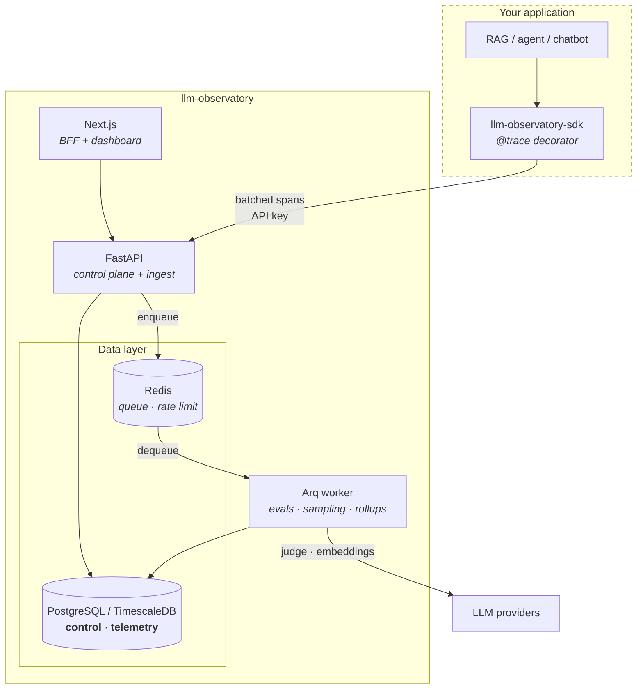

# llm-observatory

A self-hosted evaluation and observability platform for LLM applications.
Plug your RAG system, agent or chatbot into it and get: versioned prompts,
reproducible eval runs, regression detection between runs, distributed tracing
in production, and a review queue that turns flagged production traffic back
into eval data.

Think of it as the parts of LangSmith / Braintrust / Arize you actually depend
on, built to run inside your own infrastructure.

---

## Why this exists

Teams shipping LLM features hit the same wall in the same order:

1. **"Did that prompt change make things better or worse?"** Nobody knows,
   because the previous prompt was edited in place and the previous eval was a
   notebook that has since been re-run.
2. **"Why was that answer wrong?"** The logs have a request and a response. They
   do not have the retrieved chunks, the rerank order, or which of the four
   model calls in the chain actually went sideways.
3. **"What is this costing us, and where?"** Token spend is one line item from
   the provider, not a number per prompt version, per endpoint, per customer.
4. **"We know some outputs are bad. Now what?"** Bad outputs get noticed in
   Slack, not captured — so the eval set never improves and the same failure
   ships twice.

Each of those is a data problem, not a modelling problem. This platform treats
them that way: **prompts are versioned artefacts**, **eval runs are immutable
records**, **a request is a span tree rather than a log line**, and **a flagged
trace is an eval example waiting to be labelled**.

The last one is the flywheel: production surfaces failures → sampling flags them
→ a human labels them → they become eval cases → the next prompt change is
tested against them. It is implemented here, not described.

---

## Architecture



**Request path.** The SDK buffers spans in a bounded queue and flushes them in
the background — instrumentation never blocks or fails the host application.
The API authenticates by project API key, rate-limits per project, and appends
to the `telemetry` schema.

**Eval path.** `POST /eval/run` validates, persists a run record, enqueues a job
and returns immediately. The worker fans out across examples and evaluators with
bounded concurrency, writes per-example results, and computes aggregates. Jobs
that exhaust their retries land in `control.dead_letter_jobs` with their payload
and final exception, so a failed run is inspectable and replayable rather than
gone.

**Why two schemas.** `control` is transactional and FK-heavy; `telemetry` is
append-only, high-cardinality time-series that outgrows it by orders of
magnitude. Separated from the first migration so they can be given different
retention, backup and scaling policies — and so `telemetry` can move to its own
instance without a rewrite. See [ADR 0003](docs/adr/0003-trace-storage.md).

---

## Repository layout

```
packages/core     domain layer — models, schemas, evaluators, services
packages/sdk      published client SDK (httpx only; imports nothing local)
apps/api          FastAPI entrypoint
apps/worker       Arq entrypoint
apps/web          Next.js dashboard + BFF
migrations        Alembic, one history across both schemas
infra/k8s         Kubernetes manifests
infra/terraform   GCP infrastructure as code
docs/adr          architecture decision records
```

`api` and `worker` are deliberately thin wrappers over `core`: near-identical
logic, completely different scaling profiles (request rate vs queue depth), so
they ship as separate images with separate resource limits.

---

## Quick start

Requires Docker, Python 3.13+, [uv](https://docs.astral.sh/uv/), and Node 24+.

```bash
git clone <repo> && cd llm-observatory
make bootstrap        # .env from .env.example, uv sync, npm install
make up               # Postgres (TimescaleDB) + Redis
make migrate          # alembic upgrade head
```

Then, in three terminals:

```bash
make api              # http://localhost:8000/docs
make worker
make web              # http://localhost:3000
```

Verify:

```bash
curl localhost:8000/healthz   # {"status":"alive"}
curl localhost:8000/readyz    # {"status":"ready","checks":{...}}
```

To run everything in containers instead — the same images CI builds and
Kubernetes runs:

```bash
make up-all
```

Host ports default to **5433** (Postgres) and **6380** (Redis) so the stack
coexists with another project's database on the standard ports.

```bash
make test         # pytest (integration tests need `make up && make migrate`)
make test-unit    # unit tests only — no Postgres or Redis required
make lint         # ruff check + format --check (identical to CI)
make typecheck    # mypy strict
make help         # everything else
```

### Trying the prompt registry

```bash
curl -X POST localhost:8000/projects \
  -H 'content-type: application/json' \
  -d '{"slug":"demo","name":"Demo"}'

curl -X POST localhost:8000/projects/demo/prompts \
  -H 'content-type: application/json' \
  -d '{"slug":"support-triage","name":"Support triage"}'

# Versions are immutable — this appends v1 rather than editing anything
curl -X POST localhost:8000/projects/demo/prompts/support-triage/versions \
  -H 'content-type: application/json' \
  -d '{"messages":[{"role":"system","content":"You are terse."},
                   {"role":"user","content":"{{ question }}"}],
       "parameters":{"model":"claude-opus-5"}}'
# Note: no `temperature`. Current Anthropic models reject sampling parameters
# with a 400, and the platform validates that pairing when an eval run is
# requested — so a stored prompt carrying `temperature` fails fast with one
# clear error instead of once per example, mid-run.

# Promote it. Idempotent, so a retried deploy is safe.
curl -X PUT localhost:8000/projects/demo/prompts/support-triage/labels/production \
  -H 'content-type: application/json' -d '{"version":1}'

# Render by label, exactly as the eval runner and SDK will
curl -X POST localhost:8000/projects/demo/prompts/support-triage/versions/production/render \
  -H 'content-type: application/json' \
  -d '{"variables":{"question":"Where is my order?"}}'

# After adding a v2: what am I about to ship?
curl 'localhost:8000/projects/demo/prompts/support-triage/diff?from=production&to=2'
```

### Running an eval

```bash
# A dataset (CSV or JSON; every non-reserved column becomes a template variable)
printf 'question,answer\nWhere is my order?,Shipped\nWhen will it arrive?,Tuesday\n' > /tmp/qa.csv

curl -X POST localhost:8000/projects/demo/datasets \
  -H 'content-type: application/json' \
  -d '{"slug":"support-qa","name":"Support QA"}'

curl -X POST localhost:8000/projects/demo/datasets/support-qa/versions/upload \
  -F file=@/tmp/qa.csv

# What can I score with?
curl -s localhost:8000/evaluators | jq '.[].type'

# Start a run. Returns 202 + a run id; the worker executes it.
curl -X POST localhost:8000/projects/demo/eval/runs \
  -H 'content-type: application/json' \
  -d '{"dataset":"support-qa",
       "prompt":"support-triage","prompt_version":"production",
       "evaluators":[{"type":"embedding_similarity","config":{"threshold":0.6}},
                     {"type":"regex_match","config":{"pattern":"."}}],
       "generation_provider":"fake"}'

# Poll for progress and per-example results
curl -s localhost:8000/projects/demo/eval/runs/<run-id> | jq '{status, aggregate_scores}'

# Jobs that exhausted their retries
curl -s localhost:8000/dead-letters
```

`generation_provider` defaults to `fake` — deterministic, free, no API key — so
the whole flow above runs offline. Set `LO_ANTHROPIC_API_KEY` and pass
`"generation_provider":"anthropic"` to evaluate against a real model.

### Judging and comparing runs

```bash
# Install the built-in rubrics as versioned judge prompts in this project.
# Idempotent: a rubric you have already edited is never overwritten.
curl -X POST localhost:8000/projects/demo/judges/seed | jq '.[].slug'
# judge-correctness  judge-faithfulness  judge-relevance  judge-toxicity

# A rubric is an ordinary prompt — diff it, version it, promote it
curl -s localhost:8000/projects/demo/prompts/judge-faithfulness/versions | jq '.[0].version'

# Run with a judge and retrieval metrics together
curl -X POST localhost:8000/projects/demo/eval/runs \
  -H 'content-type: application/json' \
  -d '{"dataset":"support-qa","prompt":"support-triage","prompt_version":"production",
       "evaluators":[
         {"type":"llm_judge","config":{"rubric":"judge-correctness"}},
         {"type":"retrieval_recall","config":{"k":5}},
         {"type":"retrieval_mrr"}],
       "generation_provider":"fake","judge_model":"claude-opus-5"}'

# Did this change make things worse?
curl -s 'localhost:8000/projects/demo/eval/compare?baseline=<run-a>&candidate=<run-b>' \
  | jq '{regressed: .regressed_count, improved: .improved_count,
         warnings, evaluators: [.evaluators[] | {evaluator, delta, change}]}'
```

Comparison aligns examples by dataset item id and **refuses** if the two runs
used different dataset versions — pass `align=positional` to compare by index
anyway, and the response carries a warning explaining why that is weaker. Runs
that differed in model, prompt version or judge rubric are flagged too, since a
score delta means something different depending on which one moved.

Retrieval metrics read the retrieved passages from a dataset field
(`retrieved_context` by default) and compare them against `expected_context`.
They need no model call, so they are cheap enough to gate every commit on.

### Migrations

```bash
make migrate                        # apply everything pending
make migration m="add eval runs"    # autogenerate, then review the downgrade
make downgrade                      # roll back one revision
```

Schemas are created by the migration runner, not by the Docker init script, so
`alembic upgrade head` works against any empty database — including managed
Cloud SQL, where no entrypoint script ever runs. CI additionally proves every
migration is reversible and that no model change is missing a migration.

---

## Design commitments

These are the rules the codebase actually enforces, not aspirations:

- **No hardcoded secrets.** Config is `pydantic-settings`; secrets are
  `SecretStr` so they cannot be logged by accident. `assert_production_safe()`
  refuses to start any non-local environment still carrying a dev default.
- **Liveness and readiness are different probes.** `/healthz` checks nothing
  external — if it consulted Postgres, a database blip would fail every pod's
  liveness probe and the kubelet would restart the whole fleet. `/readyz` checks
  dependencies and returns 503, removing the pod from the Service until it
  recovers.
- **The SDK cannot break your app.** Bounded queue, background flush, drop and
  count on overflow, never raises into the caller, inert when unconfigured.
- **No async job disappears.** Retries with backoff, then a dead-letter record
  carrying the payload and the exception.
- **Non-root containers, pinned base images, multi-stage builds.** The
  Kubernetes `SecurityContext` enforces `runAsNonRoot`, which is only possible
  if the image never needed root.

---

## Status

| Phase | Scope | State |
| ----- | ----- | ----- |
| 1 | Scaffolding, workspace, docker-compose, health, CI | ✅ Done |
| 2 | Prompt registry + versioning + diffs (API) | ✅ Done |
| 3 | Eval engine: datasets, evaluator plugins, async runner | ✅ Done |
| 4 | LLM-as-judge, retrieval metrics, run comparison | ✅ Done |
| 5 | Tracing SDK, ingest API, nested spans | |
| 6 | Observability dashboard | |
| 7 | Guardrail sampling, review queue, labelling flywheel | |
| 8 | API keys per project, auth across all endpoints | |
| 9 | Kubernetes manifests, Terraform for GCP | |
| 10 | CD with plan → manual approval → apply | |

## Decisions

- [ADR 0001 — Workspace and package boundaries](docs/adr/0001-workspace-and-package-boundaries.md)
- [ADR 0002 — Arq over Celery](docs/adr/0002-task-queue.md)
- [ADR 0003 — TimescaleDB for spans](docs/adr/0003-trace-storage.md)
- [ADR 0004 — Immutable prompt versions, movable labels](docs/adr/0004-prompt-versioning-model.md)
- [ADR 0005 — Eval engine: execution, evaluators, providers](docs/adr/0005-eval-engine.md)
- [ADR 0006 — Judges as prompts, retrieval metrics, comparison](docs/adr/0006-judge-retrieval-comparison.md)
