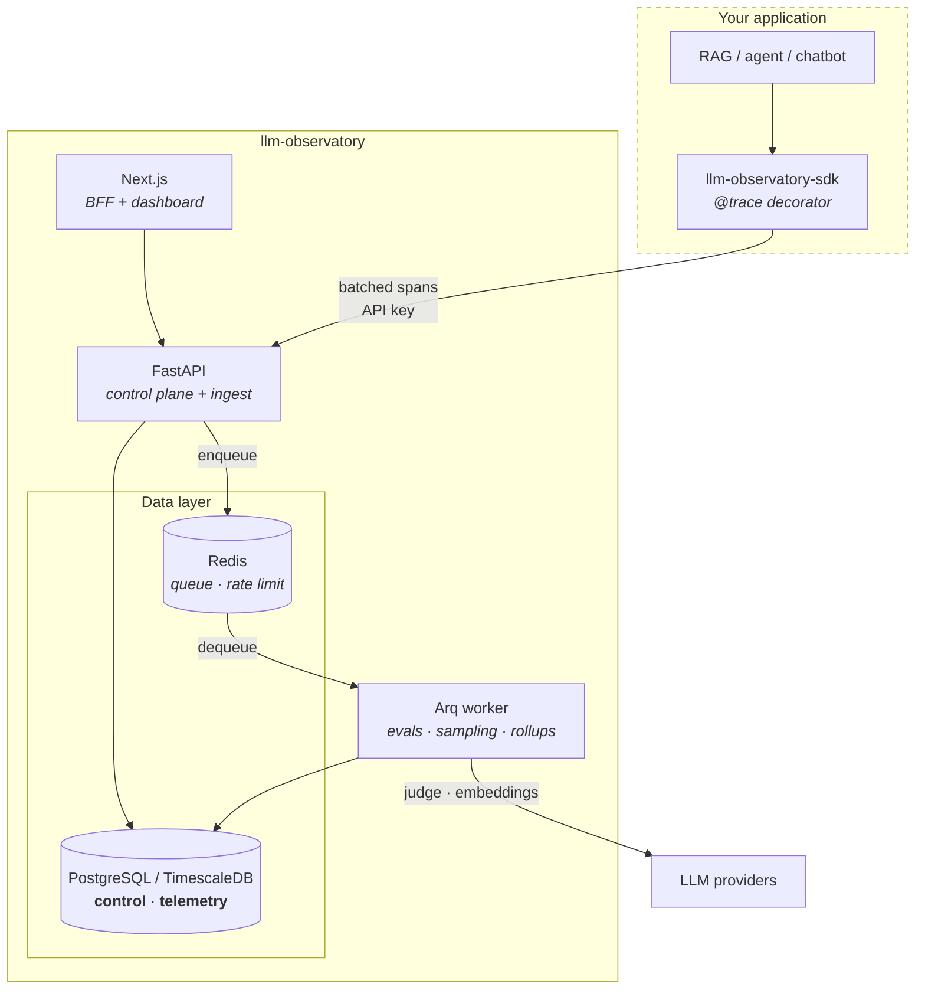

# llm-observatory

A self-hosted evaluation and observability platform for LLM applications.
Plug your RAG system, agent or chatbot into it and get: versioned prompts,
reproducible eval runs, regression detection between runs, distributed tracing
in production, and a review queue that turns flagged production traffic back
into eval data.

Think of it as the parts of LangSmith / Braintrust / Arize you actually depend
on, built to run inside your own infrastructure.

---

## Why this exists

Teams shipping LLM features hit the same wall in the same order:

1. **"Did that prompt change make things better or worse?"** Nobody knows,
   because the previous prompt was edited in place and the previous eval was a
   notebook that has since been re-run.
2. **"Why was that answer wrong?"** The logs have a request and a response. They
   do not have the retrieved chunks, the rerank order, or which of the four
   model calls in the chain actually went sideways.
3. **"What is this costing us, and where?"** Token spend is one line item from
   the provider, not a number per prompt version, per endpoint, per customer.
4. **"We know some outputs are bad. Now what?"** Bad outputs get noticed in
   Slack, not captured — so the eval set never improves and the same failure
   ships twice.

Each of those is a data problem, not a modelling problem. This platform treats
them that way: **prompts are versioned artefacts**, **eval runs are immutable
records**, **a request is a span tree rather than a log line**, and **a flagged
trace is an eval example waiting to be labelled**.

The last one is the flywheel: production surfaces failures → sampling flags them
→ a human labels them → they become eval cases → the next prompt change is
tested against them. It is implemented here, not described.

---

## Architecture



**Request path.** The SDK buffers spans in a bounded queue and flushes them in
the background — instrumentation never blocks or fails the host application.
The API authenticates by project API key, rate-limits per project, and appends
to the `telemetry` schema.

**Eval path.** `POST /eval/run` validates, persists a run record, enqueues a job
and returns immediately. The worker fans out across examples and evaluators with
bounded concurrency, writes per-example results, and computes aggregates. Jobs
that exhaust their retries land in `control.dead_letter_jobs` with their payload
and final exception, so a failed run is inspectable and replayable rather than
gone.

**Why two schemas.** `control` is transactional and FK-heavy; `telemetry` is
append-only, high-cardinality time-series that outgrows it by orders of
magnitude. Separated from the first migration so they can be given different
retention, backup and scaling policies — and so `telemetry` can move to its own
instance without a rewrite. See [ADR 0003](docs/adr/0003-trace-storage.md).

---

## Repository layout

```
packages/core     domain layer — models, schemas, evaluators, services
packages/sdk      published client SDK (httpx only; imports nothing local)
apps/api          FastAPI entrypoint
apps/worker       Arq entrypoint
apps/web          Next.js dashboard + BFF
migrations        Alembic, one history across both schemas
infra/k8s         Kubernetes manifests
infra/terraform   GCP infrastructure as code
docs/adr          architecture decision records
```

`api` and `worker` are deliberately thin wrappers over `core`: near-identical
logic, completely different scaling profiles (request rate vs queue depth), so
they ship as separate images with separate resource limits.

---

## Quick start

Requires Docker, Python 3.13+, [uv](https://docs.astral.sh/uv/), and Node 24+.

```bash
git clone <repo> && cd llm-observatory
make bootstrap        # .env from .env.example, uv sync, npm install
make up               # Postgres (TimescaleDB) + Redis
make migrate          # alembic upgrade head
```

Then, in three terminals:

```bash
make api              # http://localhost:8000/docs
make worker
make web              # http://localhost:3000
```

Verify:

```bash
curl localhost:8000/healthz   # {"status":"alive"}
curl localhost:8000/readyz    # {"status":"ready","checks":{...}}
```

To run everything in containers instead — the same images CI builds and
Kubernetes runs:

```bash
make up-all
```

Host ports default to **5433** (Postgres) and **6380** (Redis) so the stack
coexists with another project's database on the standard ports.

```bash
make test         # pytest (integration tests need `make up && make migrate`)
make test-unit    # unit tests only — no Postgres or Redis required
make lint         # ruff check + format --check (identical to CI)
make typecheck    # mypy strict
make help         # everything else
```

### Authenticating

Every endpoint requires a credential. There are two kinds, and the difference
matters:

| | `LO_ADMIN_TOKEN` | project API key (`lo_live_…`) |
| --- | --- | --- |
| Belongs to | whoever runs the platform | one project |
| Created by | `make bootstrap`, into `.env` | `POST /projects/{slug}/api-keys` |
| Can do | create projects, issue keys, read any project | whatever its scopes allow, in its project only |
| Cannot do | ingest spans | anything in another project |
| Stored as | config, never in the database | SHA-256 + server pepper — plaintext shown once |

Both travel as `Authorization: Bearer <credential>`. `/healthz` and `/readyz`
are the only open routes, because probes cannot hold secrets.

```bash
export LO_ADMIN_TOKEN=$(grep '^LO_ADMIN_TOKEN=' .env | cut -d= -f2)
curl -X POST localhost:8000/projects \
  -H "Authorization: Bearer $LO_ADMIN_TOKEN" \
  -H 'content-type: application/json' -d '{"slug":"demo","name":"Demo"}'
```

Scopes are `ingest`, `read`, `write`, and `admin`. `admin` implies read and
write; **`ingest` is implied by nothing**, not even `admin`. Ingestion is the
only capability handed to code running outside your infrastructure, so a
leaked dashboard credential — or the operator token itself — still cannot
forge telemetry into a project.

Asking for a project your key does not belong to returns **404, not 403**. A
403 would confirm the slug exists, which hands an attacker a free list of
your tenants.

Every `curl` example below uses this helper, so the credential appears once
rather than in twenty snippets:

```bash
lo() { curl -s -H "Authorization: Bearer $LO_ADMIN_TOKEN" "$@"; }
```

### Trying the prompt registry

```bash
lo -X POST localhost:8000/projects \
  -H 'content-type: application/json' \
  -d '{"slug":"demo","name":"Demo"}'

lo -X POST localhost:8000/projects/demo/prompts \
  -H 'content-type: application/json' \
  -d '{"slug":"support-triage","name":"Support triage"}'

# Versions are immutable — this appends v1 rather than editing anything
lo -X POST localhost:8000/projects/demo/prompts/support-triage/versions \
  -H 'content-type: application/json' \
  -d '{"messages":[{"role":"system","content":"You are terse."},
                   {"role":"user","content":"{{ question }}"}],
       "parameters":{"model":"claude-opus-5"}}'
# Note: no `temperature`. Current Anthropic models reject sampling parameters
# with a 400, and the platform validates that pairing when an eval run is
# requested — so a stored prompt carrying `temperature` fails fast with one
# clear error instead of once per example, mid-run.

# Promote it. Idempotent, so a retried deploy is safe.
lo -X PUT localhost:8000/projects/demo/prompts/support-triage/labels/production \
  -H 'content-type: application/json' -d '{"version":1}'

# Render by label, exactly as the eval runner and SDK will
lo -X POST localhost:8000/projects/demo/prompts/support-triage/versions/production/render \
  -H 'content-type: application/json' \
  -d '{"variables":{"question":"Where is my order?"}}'

# After adding a v2: what am I about to ship?
lo 'localhost:8000/projects/demo/prompts/support-triage/diff?from=production&to=2'
```

### Running an eval

```bash
# A dataset (CSV or JSON; every non-reserved column becomes a template variable)
printf 'question,answer\nWhere is my order?,Shipped\nWhen will it arrive?,Tuesday\n' > /tmp/qa.csv

lo -X POST localhost:8000/projects/demo/datasets \
  -H 'content-type: application/json' \
  -d '{"slug":"support-qa","name":"Support QA"}'

lo -X POST localhost:8000/projects/demo/datasets/support-qa/versions/upload \
  -F file=@/tmp/qa.csv

# What can I score with?
lo localhost:8000/evaluators | jq '.[].type'

# Start a run. Returns 202 + a run id; the worker executes it.
lo -X POST localhost:8000/projects/demo/eval/runs \
  -H 'content-type: application/json' \
  -d '{"dataset":"support-qa",
       "prompt":"support-triage","prompt_version":"production",
       "evaluators":[{"type":"embedding_similarity","config":{"threshold":0.6}},
                     {"type":"regex_match","config":{"pattern":"."}}],
       "generation_provider":"fake"}'

# Poll for progress and per-example results
lo localhost:8000/projects/demo/eval/runs/<run-id> | jq '{status, aggregate_scores}'

# Jobs that exhausted their retries
lo localhost:8000/dead-letters
```

Run against a real model without an account: the `openai` provider takes any
OpenAI-compatible endpoint, so one adapter covers OpenAI, Groq, Together,
OpenRouter, vLLM and **Ollama on your laptop**.

```bash
# Local, free, no key — the whole eval engine against a model on your machine.
export LO_GENERATION_PROVIDER=openai
export LO_OPENAI_BASE_URL=http://localhost:11434/v1
```

Cost is recorded only when talking to OpenAI itself: the same model name costs
different amounts at different gateways, and a confidently wrong cost figure is
worse than an absent one ([ADR 0013](docs/adr/0013-openai-compatible-provider.md)).

`generation_provider` defaults to `fake` — deterministic, free, no API key — so
the whole flow above runs offline. Set `LO_ANTHROPIC_API_KEY` and pass
`"generation_provider":"anthropic"` to evaluate against a real model.

### Judging and comparing runs

```bash
# Install the built-in rubrics as versioned judge prompts in this project.
# Idempotent: a rubric you have already edited is never overwritten.
lo -X POST localhost:8000/projects/demo/judges/seed | jq '.[].slug'
# judge-correctness  judge-faithfulness  judge-relevance  judge-toxicity

# A rubric is an ordinary prompt — diff it, version it, promote it
lo localhost:8000/projects/demo/prompts/judge-faithfulness/versions | jq '.[0].version'

# Run with a judge and retrieval metrics together
lo -X POST localhost:8000/projects/demo/eval/runs \
  -H 'content-type: application/json' \
  -d '{"dataset":"support-qa","prompt":"support-triage","prompt_version":"production",
       "evaluators":[
         {"type":"llm_judge","config":{"rubric":"judge-correctness"}},
         {"type":"retrieval_recall","config":{"k":5}},
         {"type":"retrieval_mrr"}],
       "generation_provider":"fake","judge_model":"claude-opus-5"}'

# Did this change make things worse?
lo 'localhost:8000/projects/demo/eval/compare?baseline=<run-a>&candidate=<run-b>' \
  | jq '{regressed: .regressed_count, improved: .improved_count,
         warnings, evaluators: [.evaluators[] | {evaluator, delta, change}]}'
```

Comparison aligns examples by dataset item id and **refuses** if the two runs
used different dataset versions — pass `align=positional` to compare by index
anyway, and the response carries a warning explaining why that is weaker. Runs
that differed in model, prompt version or judge rubric are flagged too, since a
score delta means something different depending on which one moved.

Retrieval metrics read the retrieved passages from a dataset field
(`retrieved_context` by default) and compare them against `expected_context`.
They need no model call, so they are cheap enough to gate every commit on.

### Tracing your own app

Issue a key, then instrument in three lines:

```bash
lo -X POST localhost:8000/projects/demo/api-keys \
  -H 'content-type: application/json' \
  -d '{"name":"my-app","scopes":["ingest"]}' | jq -r .key
# lo_live_...  <- shown once, never retrievable again
```

```python
from anthropic import Anthropic
from llm_observatory import configure, instrument, trace, span

configure(api_key="lo_live_...", endpoint="http://localhost:8000")
client = instrument(Anthropic())          # every model call becomes a span

@trace("answer_question")
def answer(question: str) -> str:
    with span("retrieval", kind="retrieval") as s:
        docs = retriever(question)
        s.set_output(docs)                # nested under answer_question

    return client.messages.create(        # nested too, with tokens and cost
        model="claude-opus-5", max_tokens=1024,
        messages=[{"role": "user", "content": question}],
    )
```

Then read the tree back:

```bash
lo localhost:8000/projects/demo/traces | jq '.[0]'
lo localhost:8000/projects/demo/traces/<trace-id> | jq '.root'
```

**The SDK cannot break your application.** Bounded queue, background daemon
thread, drop-and-count on overflow, never raises into the caller, and completely
inert when `LO_API_KEY` is unset. Point it at a dead endpoint and your code runs
exactly as before — there is a test that asserts precisely that.

### Already using OpenTelemetry?

Then you do not need the SDK above. An application instrumented with
OpenTelemetry — directly, or via OpenLLMetry, Logfire, or a Collector — points
here with two environment variables and no code change:

```bash
export OTEL_EXPORTER_OTLP_ENDPOINT=http://localhost:8000/otlp
export OTEL_EXPORTER_OTLP_HEADERS="Authorization=Bearer lo_live_..."
```

`OTEL_EXPORTER_OTLP_ENDPOINT` is a base URL that exporters append `/v1/traces`
to, which is why the collector-compatible endpoint lives under `/otlp` rather
than fighting the native SDK for `/v1/traces`. Both protobuf and JSON are
accepted, because protobuf is what the OTel SDKs send by default.

`Content-Encoding: gzip` is handled, which the Collector's `otlphttp` exporter
enables by default.

**OTLP/HTTP only — `OTEL_EXPORTER_OTLP_PROTOCOL=grpc` is not supported.** It is
the default in several language SDKs, and pointing a gRPC exporter here means
nothing arrives with no obvious reason why, so set the protocol explicitly if
your SDK defaults to gRPC.

The GenAI semantic conventions are mapped onto the same span model the native
SDK writes to — tokens, model, cost and operation kind become real columns, and
anything unrecognised is kept in `metadata` rather than dropped. Three
generations of attribute spelling are read (`gen_ai.usage.input_tokens`, the
older `gen_ai.usage.prompt_tokens`, and OpenLLMetry's `llm.usage.prompt_tokens`)
so you do not have to match your instrumentation to ours. See
[ADR 0012](docs/adr/0012-otlp-ingest.md).

### The dashboard

```bash
make web        # http://localhost:3000
```

Pick a project, then:

| View | What it shows |
| --- | --- |
| Overview | Volume, p50/p95/p99, error rate and cost over time, plus a per-model breakdown. Polls every 10s. |
| Traces | Production requests, filterable by status. Click one for the span waterfall. |
| Prompts | The registry, with a side-by-side version diff. Judge rubrics listed separately. |
| Evals | Run history, per-example results, and baseline-vs-candidate comparison. |
| Settings | API keys and alert rules. |

The browser never holds a credential — Next.js server code calls the API and the
key stays server-side. That is why CORS is only opened for localhost.

### Alerting

```bash
lo -X POST localhost:8000/projects/demo/alerts \
  -H 'content-type: application/json' \
  -d '{"name":"high error rate","metric":"error_rate","comparison":"above",
       "threshold":0.05,"window_seconds":300,"min_sample_size":5,
       "cooldown_seconds":900,"webhook_url":"https://example.test/hook"}'
```

The worker evaluates every rule once a minute. Four gates before anything is
sent: cooldown (so a sustained breach notifies once, not sixty times), minimum
sample size (one failure out of three is not a 33% outage), the threshold, then
delivery. Webhooks are HMAC-signed with `x-lo-signature` so the receiver can
prove the alert came from you.

`trace_count below N` doubles as a heartbeat — it catches a pipeline that stopped
sending, which no threshold-above rule would ever see.

### How fast is ingest?

Measured, not estimated — `bench/ingest.js` (k6) against the local compose
stack. **Spans per second, because batch size is a free variable and a
request-rate figure means nothing without it.**

| concurrent clients | spans/sec | native p50 / p95 / p99 | OTLP p50 / p95 / p99 |
| --- | --- | --- | --- |
| 5 | 3,270 | 68 / 94 / 120 ms | 76 / 107 / 135 ms |
| 10 | 3,230 | 144 / 205 / 468 ms | 151 / 194 / 256 ms |
| 20 | 3,230 | 280 / 382 / 488 ms | 310 / 489 / 630 ms |
| 40 | 3,277 | 579 / 830 / 1050 ms | 612 / 1110 / 1720 ms |

50-span batches, zero failed requests at every level.

**Throughput is flat while latency scales linearly with concurrency.** That is
saturation, not headroom: by Little's Law, if the arrival rate is pinned by the
server then extra clients can only add queueing. Saturation is at or below 5
concurrent clients, so the useful figure is **~3,250 spans/sec sustained with
p95 under 100 ms** — not the largest number a higher client count can be made
to print.

OTLP costs roughly 10–20% over the native path at the same load, which is the
protobuf-shaped decoding and GenAI attribute mapping it does and the native
path does not.

The bottleneck is the single uvicorn process, deliberately: the API runs one
process per pod because `prometheus_client` holds counters in process memory
([ADR 0014](docs/adr/0014-self-observability.md)), so the platform scales out on
replicas rather than up on `--workers`.

<sub>Apple M2, 8 cores, 8 GB RAM, macOS 26.5. Postgres and Redis in Docker on
the same machine, no network hop, one replica of everything, and the host
filesystem at 100% capacity while recording — so these are a floor for this
hardware, not a capacity claim about the software. Methodology and the full
list of caveats: [bench/README.md](bench/README.md).</sub>

### Watching the platform itself

An observability tool that cannot answer "how am *I* doing" is an awkward thing
to demo. Both services expose Prometheus metrics — ingest rate, queue depth,
eval run duration, provider latency and error counts:

```bash
curl -s localhost:8000/metrics | grep '^lo_'     # API, no credential needed
curl -s localhost:9464/metrics | grep '^lo_'     # worker, its own port
```

There are now two metrics systems, and the split is deliberate:
`/projects/{slug}/metrics` answers *"how is my application behaving"* for one
tenant out of TimescaleDB; `/metrics` answers *"how is the platform behaving"*
for whoever operates it.

**Nothing on `/metrics` is labelled by project, model, prompt or user.** A
Prometheus label per tenant is a permanent time series per tenant — including
tenants who left a year ago, since nothing tells Prometheus a project was
deleted. That rule is also what makes it safe to serve the endpoint without a
credential: there is no tenant data in it to leak, and the access control is the
NetworkPolicy. A test enforces both halves together
([ADR 0014](docs/adr/0014-self-observability.md)).

Import `infra/grafana/platform-health.json` for the dashboard.

### The data flywheel

Turn production failures into eval examples:

```bash
# 1. Enable sampling. 10% of traffic, plus 5% of clean traces as a control.
lo -X PUT localhost:8000/projects/demo/guardrails \
  -H 'content-type: application/json' \
  -d '{"enabled":true,"sample_rate":0.1,"control_sample_rate":0.05}'

# 2. Send traffic. The worker samples every five minutes and runs three
#    checks — PII regex, a grounding heuristic, and a toxicity wordlist.

# 3. Look at what got flagged, worst first.
lo localhost:8000/projects/demo/review | jq '.[] | {output, findings}'

# 4. Label it, supplying the answer it should have given.
lo -X POST localhost:8000/projects/demo/review/<id>/label \
  -H 'content-type: application/json' \
  -d '{"verdict":"bad","reason":"hallucinated_price",
       "corrected_output":"I do not have pricing for that item."}'

# 5. Promote a batch into a dataset. One promotion, one new version.
lo -X POST localhost:8000/projects/demo/review/promote \
  -H 'content-type: application/json' \
  -d '{"item_ids":["<id>"],"dataset":"qa"}'
```

The example is now an ordinary eval case, carrying provenance in its metadata —
which trace it came from, who labelled it, and why. The next prompt change is
tested against the failure that produced it.

**The control sample is the part worth understanding.** Reviewing only flagged
traces means you only ever see failures your checks already know how to find. A
slice of *clean* traffic goes to the queue too, and `estimated_miss_rate` — the
share of those a human judged bad — is the false-negative rate of your
heuristics. Almost no guardrail system reports that about itself.

Or do all of it in the dashboard at `/demo/review`.

### Deploying

Three environments, one set of base manifests:

```
infra/k8s/base              plain YAML, no templating, applies as-is
infra/k8s/overlays/kind     local cluster: in-cluster Postgres and Redis
infra/k8s/overlays/gcp      GKE: Memorystore, Secret Manager, managed cert
infra/terraform             the GCP substrate — VPC, GKE, Redis, IAM, secrets
```

Run the whole platform on a real Kubernetes cluster, on your laptop, for free:

```bash
make kind-up        # single-node cluster in Docker + generated secrets
make kind-deploy    # build, load, migrate, roll out, wait for ready
make kind-status
```

Then http://localhost:30300 for the dashboard and http://localhost:30800/docs
for the API. `make kind-down` removes it.

Validate without a cluster or a cloud account:

```bash
make k8s-validate   # kubeconform -strict against real Kubernetes API schemas
make tf-validate    # terraform validate against real GCP provider schemas
make infra-check    # both, plus terraform fmt -check — what CI runs
```

**On what is and is not proven.** The Kubernetes half runs for real: CI stands
up a `kind` cluster, applies the manifests, waits for every rollout, and smoke
tests through the NodePort. The Terraform half is `init`, `validate` and `fmt`
only — this project has never run `terraform apply`, there is no GCP account
behind it, and there is deliberately no `make tf-apply` target. `validate`
type-checks every resource argument against the downloaded provider schemas, so
it catches a misspelled attribute or a wrong type; it cannot catch quota, IAM
propagation, or whether a machine type exists in a zone. ADR 0011 has the full
table of what is executed and what is not.

**Two things worth reading the manifests for.** The database is a StatefulSet
rather than Cloud SQL, because Cloud SQL cannot load the `timescaledb`
extension that `telemetry.spans` depends on — a constraint, not a preference,
and Redis is managed precisely because nothing forces our hand there. And no
Secret is ever committed: locally Kustomize generates one from a gitignored
file, in production the External Secrets Operator materialises it from GCP
Secret Manager, and Terraform creates the secret *containers* but never a
version — because a value passed to Terraform is a value in state.

### Migrations

```bash
make migrate                        # apply everything pending
make migration m="add eval runs"    # autogenerate, then review the downgrade
make downgrade                      # roll back one revision
```

Schemas are created by the migration runner, not by the Docker init script, so
`alembic upgrade head` works against any empty database — including managed
Cloud SQL, where no entrypoint script ever runs. CI additionally proves every
migration is reversible and that no model change is missing a migration.

---

## Design commitments

These are the rules the codebase actually enforces, not aspirations:

- **No hardcoded secrets.** Config is `pydantic-settings`; secrets are
  `SecretStr` so they cannot be logged by accident. `assert_production_safe()`
  refuses to start any non-local environment still carrying a dev default.
- **Liveness and readiness are different probes.** `/healthz` checks nothing
  external — if it consulted Postgres, a database blip would fail every pod's
  liveness probe and the kubelet would restart the whole fleet. `/readyz` checks
  dependencies and returns 503, removing the pod from the Service until it
  recovers.
- **The SDK cannot break your app.** Bounded queue, background flush, drop and
  count on overflow, never raises into the caller, inert when unconfigured.
- **No async job disappears.** Retries with backoff, then a dead-letter record
  carrying the payload and the exception.
- **Non-root containers, pinned base images, multi-stage builds.** The
  Kubernetes `SecurityContext` enforces `runAsNonRoot`, which is only possible
  if the image never needed root.

---

## Status

| Phase | Scope | State |
| ----- | ----- | ----- |
| 1 | Scaffolding, workspace, docker-compose, health, CI | ✅ Done |
| 2 | Prompt registry + versioning + diffs (API) | ✅ Done |
| 3 | Eval engine: datasets, evaluator plugins, async runner | ✅ Done |
| 4 | LLM-as-judge, retrieval metrics, run comparison | ✅ Done |
| 5 | Tracing SDK, ingest API, nested spans | ✅ Done |
| 6 | Observability dashboard + alerting | ✅ Done |
| 7 | Guardrail sampling, review queue, labelling flywheel | ✅ Done |
| 8 | API keys per project, auth across all endpoints | ✅ Done |
| 9 | Kubernetes manifests, Terraform for GCP | ✅ Done |
| 10 | CD with plan → manual approval → apply | next |

## Decisions

- [ADR 0001 — Workspace and package boundaries](docs/adr/0001-workspace-and-package-boundaries.md)
- [ADR 0002 — Arq over Celery](docs/adr/0002-task-queue.md)
- [ADR 0003 — TimescaleDB for spans](docs/adr/0003-trace-storage.md)
- [ADR 0004 — Immutable prompt versions, movable labels](docs/adr/0004-prompt-versioning-model.md)
- [ADR 0005 — Eval engine: execution, evaluators, providers](docs/adr/0005-eval-engine.md)
- [ADR 0006 — Judges as prompts, retrieval metrics, comparison](docs/adr/0006-judge-retrieval-comparison.md)
- [ADR 0007 — Tracing: spans, ingestion, the SDK contract](docs/adr/0007-tracing-and-ingestion.md)
- [ADR 0008 — Dashboard metrics, the BFF, and alerting](docs/adr/0008-dashboard-and-alerting.md)
- [ADR 0009 — Guardrail sampling and the data flywheel](docs/adr/0009-guardrails-and-the-flywheel.md)
- [ADR 0010 — Authentication and authorisation](docs/adr/0010-authentication-and-authorisation.md)
- [ADR 0011 — Deployment topology: containers, Kubernetes, GCP](docs/adr/0011-deployment-topology.md)
- [ADR 0012 — OTLP ingest and the GenAI semantic conventions](docs/adr/0012-otlp-ingest.md)
- [ADR 0013 — One adapter for every OpenAI-compatible endpoint](docs/adr/0013-openai-compatible-provider.md)
- [ADR 0014 — Self-observability and the cardinality line](docs/adr/0014-self-observability.md)
- [ADR 0015 — Measuring ingest throughput](docs/adr/0015-load-benchmark.md)
