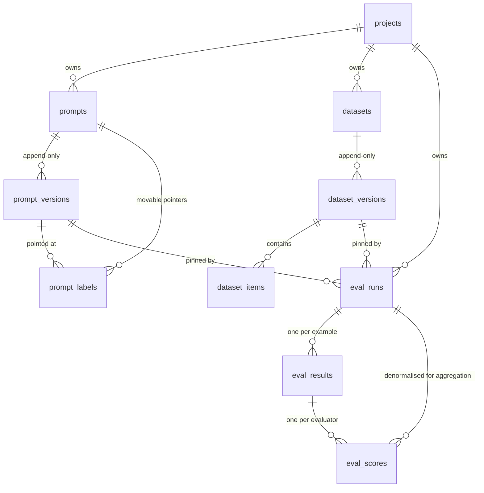

# Understanding llm-observatory

A ground-up explanation of what you've built, why each piece exists, and how it
all fits together. Read it in order the first time; after that, jump to whatever
section you need.

---

## 0. The 60-second version

You are building a **tool for other engineers**, not an AI product.

Imagine a team has a chatbot. They tweak the prompt. Was that better or worse?
Right now, nobody knows — the old prompt was overwritten, and the "test" was a
notebook someone re-ran. Your platform fixes that by making four things true:

1. **Prompts are versioned and never edited in place** — like git commits.
2. **Test datasets are versioned too** — so the same test means the same thing.
3. **Every test run is a permanent record** of exactly what ran and what scored.
4. **Two runs can be compared** to answer: *did this change make things worse?*

Everything else in the codebase exists to make those four things true and
trustworthy.

---

## 1. The problem, told as a story

A team ships a support chatbot. On Monday it works well. On Friday, customers
complain the answers got vague.

Someone asks: **what changed?**

- The prompt was edited on Wednesday — but the old text is gone, overwritten.
- The model was upgraded on Thursday — but nobody wrote that down.
- There *was* an eval script, but it was re-run against a dataset that has since
  had 40 new examples added, so its old score of 0.82 isn't comparable to
  today's 0.71.

Three changes, no records, no way to attribute the regression to any of them.
The team ends up guessing.

**Your platform makes that story impossible.** Not by being clever — by being
strict about record-keeping. That's genuinely the whole insight.

---

## 2. The one big idea

> **Immutable records + movable pointers.**

Everything important is written once and never changed. Anything that needs to
"move" is a separate pointer that points *at* one of those frozen records.

You already know this pattern from two places:

**Git.** A commit is immutable — its hash is derived from its content, so you
literally cannot change it. But `main` is a *branch*: a movable pointer that
points at a commit. When you commit, `main` moves; the old commit still exists.

**Docker.** An image layer is immutable. `myapp:latest` is a *tag* — a movable
pointer. Pushing a new image moves `latest`; the old image is still there and
still pullable by its digest.

Your platform does exactly this:

| Frozen record | Movable pointer |
| --- | --- |
| `prompt_versions` (v1, v2, v3…) | `prompt_labels` (`production` → v2) |
| `dataset_versions` (v1, v2…) | *(none needed — runs pin a version directly)* |
| `eval_runs` (a completed run) | *(none — a run is history)* |

**Why this matters so much:** an eval run stores `prompt_version_id = <uuid of
v2>`. Because v2 can never change, that run's result stays interpretable
forever. If you could edit v2 in place, every historical result would silently
start describing something that never happened.

---

## 3. The concepts you need

Each of these is a thing I used in the code. If any felt like magic, this is
where it gets unpacked.

### 3.1 Immutable versioning

When you "edit" a prompt, the code does **not** run `UPDATE`. It runs `INSERT`
with `version = max(version) + 1`.

```python
# packages/core/src/lo_core/services/prompts.py
current_max = await session.scalar(
    select(func.max(PromptVersion.version)).where(PromptVersion.prompt_id == prompt.id)
)
next_version = (current_max or 0) + 1
```

Three tables express one prompt:

```
prompts             "support-triage"          <- the name. Never holds content.
  prompt_versions     v1, v2, v3              <- the content. Frozen forever.
    prompt_labels     production -> v2        <- the pointer. Moves.
```

Notice `prompt_versions` has a `created_at` but **no `updated_at`**. That
absence is deliberate — it's the schema telling you these rows are never
modified.

### 3.2 The race condition, and the row lock

`max(version) + 1` is a **read-then-write**. Two requests at the same instant
both read `max = 3`, both try to insert `version = 4`, and one crashes.

Two defences:

**The backstop:** a database constraint `UNIQUE (prompt_id, version)`. Even if
the code is wrong, the database refuses to store two version 4s.

**The fix:** lock the prompt's row first, so writers queue up.

```python
await session.execute(select(Prompt.id).where(Prompt.id == prompt.id).with_for_update())
```

`SELECT ... FOR UPDATE` means "nobody else may touch this row until my
transaction ends." Concurrent writers to the *same* prompt now go one at a time.
Writers to *different* prompts never wait, because the lock is on one row, not
the whole table.

### 3.3 Foreign keys: CASCADE vs RESTRICT

A foreign key says "this column points at a row in another table." When the
target is deleted, the database needs a rule:

- **`ON DELETE CASCADE`** — delete me too.
- **`ON DELETE RESTRICT`** — refuse the delete.

I used both, deliberately:

```python
# Delete a project -> delete its prompts. Cleanup should be easy.
project_id: ... ForeignKey("control.projects.id", ondelete="CASCADE")

# Delete a prompt version that a run references -> REFUSE.
prompt_version_id: ... ForeignKey("control.prompt_versions.id", ondelete="RESTRICT")
```

That second one is the interesting one. An eval run says "I tested prompt
version X." If X could be deleted, the run becomes an uninterpretable orphan —
a score with no idea what produced it. RESTRICT makes the database refuse.

You actually *saw* this fire: the test cleanup failed until I deleted eval runs
before deleting the project. That wasn't a bug; the constraint was doing its job.

### 3.4 Migrations (Alembic)

Your Python code defines what tables *should* look like. The database has what
they *currently* look like. A **migration** is a script that moves the database
from one state to the next.

```bash
make migration m="add judge link"   # compares code to DB, writes the script
make migrate                        # runs pending scripts
```

Each migration has an `upgrade()` and a `downgrade()`. CI proves both work:

```yaml
- run: uv run alembic upgrade head
- run: |
    uv run alembic downgrade base   # can we go back?
    uv run alembic upgrade head     # and forward again?
- run: uv run alembic check          # does code match DB?
```

That last one is the sneaky-valuable one. If you change a model and forget the
migration, everything works on *your* machine (your DB already has the column)
and breaks on a fresh deploy. `alembic check` catches it in CI.

**One subtle thing I got wrong and fixed:** schemas (`control`, `telemetry`)
are created by the migration runner, not by the Docker startup script. The
Docker script only runs for a fresh local volume — a managed cloud database
never runs it. So `alembic upgrade head` now works against any empty database.

### 3.5 Transactions and sessions

A **transaction** is a group of database operations that either all happen or
none do.

A **session** (SQLAlchemy's `AsyncSession`) is your handle for talking to the
database. **It is not safe to use from multiple concurrent tasks.** Sharing one
across `asyncio.gather` corrupts its internal state in ways that surface as
bizarre errors far from the cause.

That's why the runner opens a *new* session per concurrent example:

```python
# packages/core/src/lo_core/services/runner.py
async def _write_result(...):
    async with session_scope() as session:   # its own session, its own transaction
        ...
```

In the API it's different — one transaction per HTTP request, so a handler that
does three things either does all three or none:

```python
# apps/api/src/lo_api/dependencies.py
async def db_session():
    async with get_sessionmaker()() as session:
        try:
            yield session
            await session.commit()      # success -> commit
        except Exception:
            await session.rollback()    # failure -> undo everything
            raise
```

### 3.6 Why evals run on a queue, not in the request

If `POST /eval/runs` actually ran the eval, the HTTP request would sit open for
minutes while 500 model calls happen. Every proxy between the client and your
API would time out. One eval would tie up a web worker.

So instead:

```
API                      Redis                    Worker
 |                         |                        |
 |-- validate + save run ->|                        |
 |-- enqueue job --------->|                        |
 |<- return 202 + run id   |-- deliver job -------->|
 |                         |                        |-- run 500 examples
 |                         |                        |-- write results
```

`202 Accepted` means "I've taken this, it isn't done yet." The client polls
`GET /eval/runs/{id}` for progress.

**Arq** is the job library (chosen over Celery in ADR 0002 because it's
async-native, so it reuses the exact same database code as the API).

### 3.7 Retries and the dead-letter queue

Jobs fail. Arq retries 3 times with backoff. But what happens after the third
failure? By default: nothing. The job vanishes from Redis, and the run sits at
`running` forever with no explanation.

So we catch the last attempt and write a record:

```python
# apps/worker/src/lo_worker/tasks/evaluation.py
if attempt >= MAX_TRIES:
    await record_dead_letter(session, job_id=..., exc=exc, ...)
    return "failed"
```

`control.dead_letter_jobs` holds the payload, the exception, the traceback, and
a link to the run. A failure becomes *inspectable and replayable* instead of
gone. Visible at `GET /dead-letters`.

### 3.8 Prompt templates and the sandbox

A prompt isn't a string, it's a **template**:

```
"Answer using only this context.
[{{ loop.index }}] {{ d.text }}
Question: {{ question }}"
```

That's Jinja2 — the same templating you'd use in Flask.

Two settings do a lot of work:

**`SandboxedEnvironment`** instead of the normal one. Templates come from API
callers and get rendered on your server. With a plain Jinja environment, this
works:

```
{{ ''.__class__.__mro__[1].__subclasses__() }}
```

That's the classic path from "I can edit a template" to "I can reach arbitrary
Python objects" — a real remote-code-execution hole. The sandbox blocks it. You
saw it return a 422 when we tested it.

**`StrictUndefined`.** By default, Jinja renders an unknown variable as empty
string. So a typo like `{{ contxt }}` produces a perfectly well-formed prompt
with the retrieved context silently *missing*. The quality drops, and it looks
like a model regression rather than a typo. Strict mode makes it an error.

### 3.9 The evaluator pattern

An **evaluator** answers one question about one output and returns a score.

```python
# packages/core/src/lo_core/evaluators/base.py
class Evaluator[ConfigT: BaseModel](abc.ABC):
    name: ClassVar[str]                    # "exact_match"
    Config: ClassVar[type[BaseModel]]      # its config schema

    @abc.abstractmethod
    async def evaluate(self, sample) -> EvaluatorOutcome: ...
```

New evaluators register themselves with a decorator:

```python
@register
class ExactMatchEvaluator(Evaluator[ExactMatchConfig]):
    name = "exact_match"
```

The registry is just a dict. I deliberately did *not* use Python "entry points"
(the plugin mechanism for separate packages) — with one consumer it would make
evaluators invisible to your IDE and turn a typo into a runtime failure instead
of an import error.

**All 8 evaluators:**

| Name | Needs a model? | What it asks |
| --- | --- | --- |
| `exact_match` | no | Does the output equal the expected answer? |
| `regex_match` | no | Does it match this pattern? |
| `json_schema` | no | Is it valid JSON matching this schema? |
| `embedding_similarity` | embeddings | Does it *mean* the same thing? |
| `llm_judge` | yes | Rubric-based scoring by a model |
| `retrieval_precision` | no | Of what we retrieved, how much was relevant? |
| `retrieval_recall` | no | Of what was relevant, how much did we retrieve? |
| `retrieval_mrr` | no | How high did the first relevant doc rank? |

### 3.10 Scores are 0.0–1.0, and can be null

**Everything normalises to 0.0–1.0.** A boolean match, a cosine similarity, and
a judge's 1–5 rating all land on the same scale. That's what lets one
`GROUP BY` aggregate all of them and one comparison view diff all of them.

**Score is nullable, paired with an `error`.** This is the subtlest idea in the
codebase, so here it is concretely:

Say you run `exact_match` on two examples. Example 1 is correct (1.0). Example 2
has **no expected answer recorded** in the dataset.

- If you score example 2 as `0.0` → mean is **0.5**. Looks like half your
  answers are wrong. You go debug a model that's fine.
- If you score example 2 as `null` → mean is **1.0**, and a separate
  `unscoreable: 1` counter tells you the dataset has a gap.

SQL's `AVG()` skips nulls, so this works automatically. "I couldn't measure
this" and "this was wrong" are different facts and must not be mixed.

### 3.11 Providers, and why a fake one exists

The eval engine never imports the Anthropic SDK directly. It asks a
`GenerationProvider` for text.

```python
class GenerationProvider(abc.ABC):
    async def generate(self, request: GenerationRequest) -> GenerationResponse: ...
```

Two implementations:

- **`FakeGenerationProvider`** — deterministic. Hashes the input, echoes it back.
- **`AnthropicProvider`** — the real thing.

The fake isn't a shortcut. It's the reason your test suite can exist. Real-model
tests would be non-deterministic (same prompt, different text each time), slow,
and **billed on every CI run** — so nobody would run them on every commit. The
fake makes the runner's actual logic (concurrency, resume, aggregation,
dead-lettering) verifiable for free.

It also echoes its input, which lets tests configure *real* evaluators against a
predictable answer.

### 3.12 The collision you should be able to explain

Here's my favourite thing in the codebase, because it's two of your own
decisions crashing into each other.

**Decision 1 (Phase 2):** store decoding parameters *with* the prompt version.
So a prompt saved months ago carries `temperature: 0.0`.

**Decision 2 (reality):** current Anthropic models **reject** `temperature` with
a 400 error. It was removed from the API.

So: a perfectly valid stored prompt + a current model = guaranteed failure. And
without a check, it fails *once per example, mid-run*, after you've already paid
for the examples that succeeded.

The fix is a check at run-creation time:

```python
# packages/core/src/lo_core/providers/pricing.py
SAMPLING_UNSUPPORTED = frozenset({"claude-opus-5", "claude-sonnet-5", ...})

def unsupported_sampling_parameters(model, parameters):
    if model not in SAMPLING_UNSUPPORTED:
        return []
    return sorted({"temperature", "top_p", "top_k"} & parameters.keys())
```

N mid-run 400s become one clear 422 on one API call.

### 3.13 The judge, and why it's a prompt

An LLM-as-judge scores subjective things — "is this answer faithful to the
context?" — by asking a model.

**The rubric is stored in the prompt registry**, not in code. Judges are just
prompts with `kind = "judge"`.

Why? Because a rubric is a *measuring instrument*. If you edit "score 4 = minor
omission" to "score 4 = near-perfect", every score it produces drops — and that
looks **exactly** like your model got worse.

So the run records `judge_prompt_version_id`. Now a score drop is attributable:
either the model changed or the rubric changed, and you can tell which.

Two more details:

**Structured output, not regex.** The judge is asked for JSON matching a schema:

```python
JUDGE_RESPONSE_SCHEMA = {
    "type": "object",
    "properties": {
        "score": {"type": "integer", "minimum": 1, "maximum": 5},
        "reasoning": {"type": "string"},
    },
    "required": ["score", "reasoning"],
}
```

The alternative — regex-parsing "I'd say a solid 4" out of prose — breaks the
moment the model rephrases. Then every example scores null and the run still
reports success. Silent rot.

**The 1–5 scale has written anchors.** Every built-in rubric describes all five
points, and a test enforces it:

```
5 - Fully correct. Every claim matches the reference.
4 - Correct, with a minor omission that doesn't change the conclusion.
3 - Partially correct. Main claim right, something material missing.
2 - Mostly incorrect. A relevant fragment is right, substance is wrong.
1 - Incorrect, or contradicts the reference.
```

Ask a model for "a score from 0 to 1" and it returns 0.85 for nearly
everything. Ask for an unanchored 1–5 and it clusters at 3–4. **The rubric text
is the measuring instrument** — that's why it gets versioned like code.

### 3.14 Comparison: aligning by identity, not position

To compare two runs, you have to match up examples. Two ways:

**By position (index):** example #3 in run A vs example #3 in run B.
**By identity (`dataset_item_id`):** the same actual question in both.

They look equivalent. They are not:

```
Dataset v1:               Dataset v2 (one row inserted at the top):
  #0 "capital of France"    #0 "NEW QUESTION"
  #1 "largest ocean"        #1 "capital of France"
                            #2 "largest ocean"
```

Compare by index and you're comparing "capital of France" against "NEW
QUESTION" — every reported regression is between two unrelated examples.
Confidently wrong output, which is the exact failure this whole tool exists to
catch.

So: identity alignment is the default, and it **refuses** (HTTP 409) if the two
runs used different dataset versions. `align=positional` is an explicit opt-out
that attaches a warning to the response.

---

## 4. The map: what's in this repo

```
llm-observatory/
├── packages/
│   ├── core/          ← ALL the real logic lives here
│   └── sdk/           ← client library (Phase 5, mostly empty)
├── apps/
│   ├── api/           ← FastAPI: thin HTTP layer over core
│   ├── worker/        ← Arq: thin job layer over core
│   └── web/           ← Next.js (still the starter page)
├── migrations/        ← Alembic version history
├── tests/
│   ├── unit/          ← no database needed
│   └── integration/   ← needs Postgres
├── docs/adr/          ← why each decision was made
└── infra/             ← Docker, K8s + Terraform (Phase 9)
```

**The key structural idea:** `api` and `worker` are *thin*. They contain almost
no logic — they translate HTTP requests and queue jobs into calls to `core`.

Why? Because they have completely different scaling needs. The API scales on
request rate; the worker scales on queue depth. Separate images, separate
deployments, separate resource limits. If they were one program, you couldn't
scale them apart.

### Inside `packages/core/src/lo_core/`

| File / folder | What it does |
| --- | --- |
| `config.py` | Reads env vars, validates them at startup, refuses to boot with dev defaults in prod |
| `logging.py` | Structured JSON logs in prod, readable colour locally |
| `errors.py` | `NotFoundError`, `ConflictError`, `ValidationError` — domain errors that know nothing about HTTP |
| `templating.py` | Sandboxed Jinja: compile, extract variables, render, content-hash |
| `diffing.py` | Structured diff between two prompt versions |
| `db/base.py` | The two schemas (`control`, `telemetry`) and naming conventions |
| `db/mixins.py` | Shared columns: UUID primary key, timestamps |
| `db/session.py` | Engine + session factory |
| `db/models/` | The tables (SQLAlchemy classes) |
| `schemas/` | Pydantic models = the API's wire format |
| `evaluators/` | The 8 evaluators + the registry + judge rubrics |
| `providers/` | Generation + embeddings, fake + real, pricing table |
| `services/` | The actual business logic |

**Why `db/models/` and `schemas/` are separate** — this trips people up. They
look duplicative but do different jobs:

- `db/models/prompt.py` is the **database table**. Change it → migration.
- `schemas/prompt.py` is the **API contract**. Change it → breaking API change.

Keeping them apart means renaming a column doesn't break every client, and a
lazy database relationship can't accidentally get serialised into a response.

---

## 5. Follow one eval run, end to end

This is the section that ties everything together. Read it slowly.

**You send:**

```bash
POST /projects/demo/eval/runs
{
  "dataset": "support-qa",
  "prompt": "support-triage", "prompt_version": "production",
  "evaluators": [{"type": "exact_match"}],
  "generation_provider": "fake"
}
```

### Step 1 — API: resolve tenancy
`apps/api/src/lo_api/dependencies.py` turns `demo` in the URL into a `Project`
row. Every later query is scoped to that project id. In Phase 8 this is where
the API key check goes.

### Step 2 — Service: validate everything cheap
`services/evaluation.py :: create_run` checks, in order:

- is `fake` a real provider?
- do all the evaluators exist, and are their configs valid? (builds them —
  a broken regex fails **here**)
- does the dataset exist? resolve `support-qa` → dataset version id
- does the prompt exist? resolve `production` → prompt version id
- if there's a judge, resolve the rubric → judge version id
- would this model reject the prompt's stored `temperature`?

Everything that can be checked without a model call is checked *now*. The whole
point: a bad config should be a 422 on one API call, not a job that dies on
example 300 of 500 after you've already paid for 299 completions.

### Step 3 — Save a pending run
One row in `control.eval_runs`:

```
status              = "pending"
dataset_version_id  = <frozen dataset v1>
prompt_version_id   = <frozen prompt v2>
evaluators          = [{"type": "exact_match"}]
provider_config     = {"model": "fake-model", "concurrency": 8, ...}
total_items         = 3
```

Those pinned version ids are what make the result interpretable in six months.

### Step 4 — Enqueue and return
`apps/api/src/lo_api/queue.py` pushes a job to Redis, stores the job id on the
run, and the API returns **202 Accepted**. Total elapsed: milliseconds.

### Step 5 — Worker picks it up
`apps/worker/src/lo_worker/tasks/evaluation.py :: run_eval` receives the run id
and calls `execute_run` in core.

### Step 6 — Runner sets up
`services/runner.py`:

- marks the run `running`, stamps `started_at`
- builds the evaluator objects from the stored config
- loads the prompt template
- builds the embedder **only if** an evaluator needs one (loading a local ONNX
  model costs seconds and hundreds of MB — don't pay for it if nothing embeds)
- **loads which examples are already done** ← this is what makes retries resumable

### Step 7 — Run examples concurrently, but bounded

```python
semaphore = asyncio.Semaphore(8)

async def worker(item):
    async with semaphore:
        return await _execute_item(...)

outcomes = await asyncio.gather(*(worker(i) for i in pending), return_exceptions=True)
```

The semaphore caps in-flight calls at 8. Without it, 500 examples = 500
simultaneous provider connections = instant rate limit. A slow run becomes a
failed run.

`return_exceptions=True` means one task blowing up doesn't cancel its siblings
and lose their results.

### Step 8 — For each example
1. Render the template with that example's inputs
2. Call the provider → get text, tokens, latency, cost
3. **Upsert** a row into `eval_results` (upsert, so a retry updates instead of
   colliding)
4. Run each evaluator → insert rows into `eval_scores`

If generation fails, write an error row and **return `False`** — no exception
escapes. One provider timeout must not discard the other 499 results.

### Step 9 — Aggregate and finish

```sql
SELECT evaluator, AVG(score), MIN(score), MAX(score), COUNT(score)
FROM control.eval_scores WHERE eval_run_id = ... GROUP BY evaluator
```

One `GROUP BY` — that's why `eval_run_id` is duplicated onto `eval_scores`
rather than joined through `eval_results`.

Then the final status:

- 0 failures → `succeeded`
- some failures, some results → `partial`
- everything failed → `failed`

`partial` being its own state matters. A run where 3 of 500 examples errored is
neither a success (hides a provider outage) nor a failure (throws away 497
usable results).

### Step 10 — You poll

```bash
GET /projects/demo/eval/runs/{id}
```

Status, per-evaluator aggregates, and per-example results with scores.

---

## 6. Run it yourself

Each step shows you one thing working. Do them in order.

```bash
make up && make migrate
make api          # leave running
make worker       # in another terminal
```

**1. Create a project** (the tenancy boundary)

```bash
curl -X POST localhost:8000/projects -H 'content-type: application/json' \
  -d '{"slug":"demo","name":"Demo"}'
```

**2. Create a prompt, then a version**

```bash
curl -X POST localhost:8000/projects/demo/prompts -H 'content-type: application/json' \
  -d '{"slug":"triage","name":"Triage"}'

curl -X POST localhost:8000/projects/demo/prompts/triage/versions \
  -H 'content-type: application/json' \
  -d '{"messages":[{"role":"user","content":"{{ question }}"}],
       "parameters":{"model":"fake-model"}}'
```

Look at the response: it found `question` in `variables` automatically. That's
static analysis of the Jinja AST, not a regex.

**3. Prove versions are immutable** — send the same POST again with different
text. You get **v2**. v1 still exists.

**4. Promote v1 to production**

```bash
curl -X PUT localhost:8000/projects/demo/prompts/triage/labels/production \
  -H 'content-type: application/json' -d '{"version":1}'
```

Run it twice. Same result, no error — that's idempotency, which matters because
deploy pipelines get retried.

**5. See the diff**

```bash
curl 'localhost:8000/projects/demo/prompts/triage/diff?from=1&to=2'
```

**6. Try to break the sandbox**

```bash
curl -X POST localhost:8000/projects/demo/prompts/triage/versions \
  -H 'content-type: application/json' \
  -d '{"messages":[{"role":"user","content":"{{ x.__class__.__mro__ }}"}]}'
# -> 201. It stores fine; it is valid Jinja.

curl -X POST localhost:8000/projects/demo/prompts/triage/versions/3/render \
  -H 'content-type: application/json' -d '{"variables":{"x":"hi"}}'
# -> 422 "access to attribute '__class__' of 'str' object is unsafe"
```

Blocking at *execution*, not authoring, is the correct boundary.

**7. Upload a dataset**

```bash
printf 'question,answer\nWhere is my order?,Where is my order?\nWhen?,Tuesday\n' > /tmp/qa.csv

curl -X POST localhost:8000/projects/demo/datasets -H 'content-type: application/json' \
  -d '{"slug":"qa","name":"QA"}'

curl -X POST localhost:8000/projects/demo/datasets/qa/versions/upload -F file=@/tmp/qa.csv
```

**8. See what you can score with**

```bash
curl -s localhost:8000/evaluators | jq '.[].type'
```

That returns JSON Schema per evaluator — so the Phase 6 UI can build config
forms without hardcoding a copy that drifts.

**9. Run an eval**

```bash
RUN=$(curl -s -X POST localhost:8000/projects/demo/eval/runs \
  -H 'content-type: application/json' \
  -d '{"dataset":"qa","prompt":"triage","prompt_version":"1",
       "evaluators":[{"type":"exact_match"},{"type":"embedding_similarity"}],
       "generation_provider":"fake","model":"fake-model"}' | jq -r .id)

sleep 3
curl -s localhost:8000/projects/demo/eval/runs/$RUN | jq '{status, aggregate_scores}'
```

**10. Watch failure isolation work** — add a row containing `__FAIL__` to the
dataset and re-run. Status becomes `partial`: that row errors, the rest still
score.

**11. Seed the judges**

```bash
curl -X POST localhost:8000/projects/demo/judges/seed | jq '.[].slug'
```

Then look them up as ordinary prompts:

```bash
curl -s localhost:8000/projects/demo/prompts/judge-correctness/versions | jq '.[0].messages'
```

That's the whole point — a rubric *is* a prompt.

**12. Compare two runs**

```bash
curl -s "localhost:8000/projects/demo/eval/compare?baseline=$RUN_A&candidate=$RUN_B" \
  | jq '{regressed_count, improved_count, warnings}'
```

Now add a new dataset version, run again, and try to compare across versions —
you get a **409** telling you to pass `align=positional`.

---

## 7. The database, table by table

Two schemas: `control` (everything so far) and `telemetry` (empty until Phase 5).



| Table | Holds | Mutable? |
| --- | --- | --- |
| `projects` | Tenancy boundary. Everything hangs off this. | metadata |
| `prompts` | A prompt's *name*. No content. | metadata |
| `prompt_versions` | The actual messages + parameters. | **never** |
| `prompt_labels` | `production` → a version. | the pointer moves |
| `datasets` | A dataset's name. | metadata |
| `dataset_versions` | A complete snapshot of items. | **never** |
| `dataset_items` | One test example. | **never** |
| `eval_runs` | One execution: what ran, status, aggregates. | status/counters |
| `eval_results` | The generation for one example. | upsert on retry |
| `eval_scores` | One evaluator's verdict on one result. | upsert on retry |
| `dead_letter_jobs` | Jobs that exhausted retries. | `replayed_at` |

**Why `eval_results` and `eval_scores` are separate:** the model is called
**once** per example but scored by **many** evaluators. Output lives on the
result; verdicts live on the scores. Storing scores as a JSON blob on the result
would turn "mean faithfulness for this run" into JSONB gymnastics instead of a
`GROUP BY`.

---

## 8. Answering questions about this in an interview

The trap is describing *features*. Describe **decisions and their consequences**.

**"Walk me through the project."**
> It's a self-hosted eval and observability platform for LLM apps. The core
> insight is that most LLM quality problems are record-keeping problems: teams
> can't tell whether a change helped because the old prompt was overwritten and
> the old dataset has drifted. So everything is immutable and versioned —
> prompts, datasets, judge rubrics — and an eval run pins the exact version of
> each. That's what makes "run 41 scored worse than run 38" a statement you can
> actually act on.

**"Why are prompt versions immutable?"**
> Because eval runs and production traces reference them. If a version could be
> edited in place, every historical result would silently start describing
> something that never ran. It's the same reason git commits are content-hashed.

**"Why are labels a separate table instead of a column?"**
> Atomicity. With a column, moving `production` from v6 to v7 is two UPDATEs,
> and in between a reader sees either two production versions or none. As a row
> keyed on `(prompt_id, label)`, it's one `INSERT … ON CONFLICT DO UPDATE` —
> readers see the old target or the new one, never an absence.

**"How do you handle a failing example mid-run?"**
> Per-example isolation. Each example runs in its own transaction with its own
> try/except; a failure writes an error row and the run continues. The run ends
> in `partial`, which is its own terminal state — collapsing it into "succeeded"
> would hide a provider outage and into "failed" would throw away good results.

**"How is it testable if it calls LLMs?"**
> The engine never imports a vendor SDK; it depends on a provider interface. The
> default is a deterministic fake that hashes its input. That's not a shortcut —
> real-model tests are non-deterministic, slow, and billed on every CI run, so
> nobody would run them per-commit. The fake makes concurrency, resume,
> aggregation and dead-lettering all verifiable for free.

**"How do you know a judged score is trustworthy?"**
> Three things. The rubric is a versioned prompt and the run pins its version,
> so a score drop is attributable to the model or the rubric rather than
> ambiguously both. The judge returns schema-constrained JSON, so there's no
> regex to silently stop matching. And if the judge model equals the model under
> test, that's recorded on the score, because models rate their own output
> higher.

**"What's the hardest bug you hit?"**
> Migrations that silently rolled back. I added schema creation before Alembic's
> transaction, which meant the connection was already mid-transaction — so
> Alembic's `begin_transaction()` returned a no-op context manager, nothing
> committed, and it still logged "Running upgrade… done" against a database
> where no table existed. Caught it because I verified against a scratch
> database instead of trusting the log.

**"How is this different from your RAG project?"**
> That one was an AI *product* — a system that answers questions. This is AI
> *infrastructure* — a tool other teams integrate with. Most of the hard
> problems here aren't modelling: they're concurrency, schema design under
> immutability constraints, job durability, and making measurement trustworthy.

---

## 9. What's done and what's left

| Phase | Scope | State |
| --- | --- | --- |
| 1 | Scaffolding, workspace, docker-compose, CI | ✅ |
| 2 | Prompt registry, versions, labels, diffs | ✅ |
| 3 | Eval engine, datasets, evaluators, async runner | ✅ |
| 4 | Judge, retrieval metrics, run comparison | ✅ |
| 5 | Tracing SDK, ingest API, nested spans | next |
| 6 | Observability dashboard (Next.js) | |
| 7 | Guardrail sampling, review queue, flywheel | |
| 8 | API keys per project, auth everywhere | |
| 9 | Kubernetes manifests, Terraform for GCP | |
| 10 | CI/CD with plan → approve → apply | |

**Phase 5 is a real shift.** Everything so far writes to the `control` schema:
low volume, transactional, foreign keys everywhere. Traces are the opposite —
append-only, high-volume time-series. That's the `telemetry` schema, and it's
where the TimescaleDB reasoning in ADR 0003 finally gets exercised.

The frontend stays a starter page until Phase 6 — deliberately, since the eval
comparison view and the prompt diff view share most of their components and
building them together avoids doing the diff UI twice.

---

## 10. Where to look when you're stuck

- **Why was this done this way?** → `docs/adr/` — one file per decision, each
  with the alternatives I rejected and why.
- **What does this function guarantee?** → the docstring. I wrote them to
  explain *why*, not restate the signature.
- **What's the API surface?** → `http://localhost:8000/docs` while the API runs.
- **What does correct behaviour look like?** → the tests. `tests/unit/` for
  logic, `tests/integration/` for anything touching the database.

The ADRs are the highest-value thing to re-read before an interview. They're
written as arguments, not documentation.
