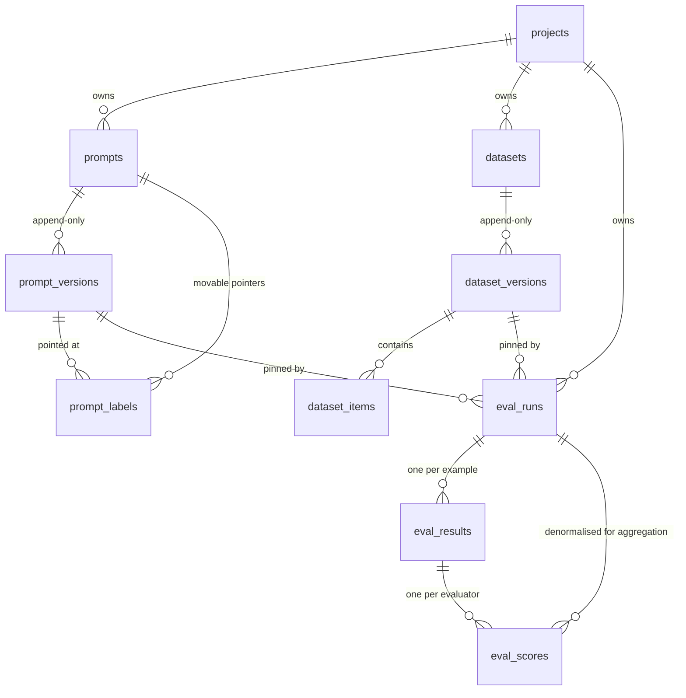

# Understanding llm-observatory

A ground-up explanation of what you've built, why each piece exists, and how it
all fits together. Read it in order the first time; after that, jump to whatever
section you need.

---

## 0. The 60-second version

You are building a **tool for other engineers**, not an AI product.

Imagine a team has a chatbot. They tweak the prompt. Was that better or worse?
Right now, nobody knows — the old prompt was overwritten, and the "test" was a
notebook someone re-ran. Your platform fixes that by making four things true:

1. **Prompts are versioned and never edited in place** — like git commits.
2. **Test datasets are versioned too** — so the same test means the same thing.
3. **Every test run is a permanent record** of exactly what ran and what scored.
4. **Two runs can be compared** to answer: *did this change make things worse?*

Everything else in the codebase exists to make those four things true and
trustworthy.

---

## 1. The problem, told as a story

A team ships a support chatbot. On Monday it works well. On Friday, customers
complain the answers got vague.

Someone asks: **what changed?**

- The prompt was edited on Wednesday — but the old text is gone, overwritten.
- The model was upgraded on Thursday — but nobody wrote that down.
- There *was* an eval script, but it was re-run against a dataset that has since
  had 40 new examples added, so its old score of 0.82 isn't comparable to
  today's 0.71.

Three changes, no records, no way to attribute the regression to any of them.
The team ends up guessing.

**Your platform makes that story impossible.** Not by being clever — by being
strict about record-keeping. That's genuinely the whole insight.

---

## 2. The one big idea

> **Immutable records + movable pointers.**

Everything important is written once and never changed. Anything that needs to
"move" is a separate pointer that points *at* one of those frozen records.

You already know this pattern from two places:

**Git.** A commit is immutable — its hash is derived from its content, so you
literally cannot change it. But `main` is a *branch*: a movable pointer that
points at a commit. When you commit, `main` moves; the old commit still exists.

**Docker.** An image layer is immutable. `myapp:latest` is a *tag* — a movable
pointer. Pushing a new image moves `latest`; the old image is still there and
still pullable by its digest.

Your platform does exactly this:

| Frozen record | Movable pointer |
| --- | --- |
| `prompt_versions` (v1, v2, v3…) | `prompt_labels` (`production` → v2) |
| `dataset_versions` (v1, v2…) | *(none needed — runs pin a version directly)* |
| `eval_runs` (a completed run) | *(none — a run is history)* |

**Why this matters so much:** an eval run stores `prompt_version_id = <uuid of
v2>`. Because v2 can never change, that run's result stays interpretable
forever. If you could edit v2 in place, every historical result would silently
start describing something that never happened.

---

## 3. The concepts you need

Each of these is a thing I used in the code. If any felt like magic, this is
where it gets unpacked.

### 3.1 Immutable versioning

When you "edit" a prompt, the code does **not** run `UPDATE`. It runs `INSERT`
with `version = max(version) + 1`.

```python
# packages/core/src/lo_core/services/prompts.py
current_max = await session.scalar(
    select(func.max(PromptVersion.version)).where(PromptVersion.prompt_id == prompt.id)
)
next_version = (current_max or 0) + 1
```

Three tables express one prompt:

```
prompts             "support-triage"          <- the name. Never holds content.
  prompt_versions     v1, v2, v3              <- the content. Frozen forever.
    prompt_labels     production -> v2        <- the pointer. Moves.
```

Notice `prompt_versions` has a `created_at` but **no `updated_at`**. That
absence is deliberate — it's the schema telling you these rows are never
modified.

### 3.2 The race condition, and the row lock

`max(version) + 1` is a **read-then-write**. Two requests at the same instant
both read `max = 3`, both try to insert `version = 4`, and one crashes.

Two defences:

**The backstop:** a database constraint `UNIQUE (prompt_id, version)`. Even if
the code is wrong, the database refuses to store two version 4s.

**The fix:** lock the prompt's row first, so writers queue up.

```python
await session.execute(select(Prompt.id).where(Prompt.id == prompt.id).with_for_update())
```

`SELECT ... FOR UPDATE` means "nobody else may touch this row until my
transaction ends." Concurrent writers to the *same* prompt now go one at a time.
Writers to *different* prompts never wait, because the lock is on one row, not
the whole table.

### 3.3 Foreign keys: CASCADE vs RESTRICT

A foreign key says "this column points at a row in another table." When the
target is deleted, the database needs a rule:

- **`ON DELETE CASCADE`** — delete me too.
- **`ON DELETE RESTRICT`** — refuse the delete.

I used both, deliberately:

```python
# Delete a project -> delete its prompts. Cleanup should be easy.
project_id: ... ForeignKey("control.projects.id", ondelete="CASCADE")

# Delete a prompt version that a run references -> REFUSE.
prompt_version_id: ... ForeignKey("control.prompt_versions.id", ondelete="RESTRICT")
```

That second one is the interesting one. An eval run says "I tested prompt
version X." If X could be deleted, the run becomes an uninterpretable orphan —
a score with no idea what produced it. RESTRICT makes the database refuse.

You actually *saw* this fire: the test cleanup failed until I deleted eval runs
before deleting the project. That wasn't a bug; the constraint was doing its job.

### 3.4 Migrations (Alembic)

Your Python code defines what tables *should* look like. The database has what
they *currently* look like. A **migration** is a script that moves the database
from one state to the next.

```bash
make migration m="add judge link"   # compares code to DB, writes the script
make migrate                        # runs pending scripts
```

Each migration has an `upgrade()` and a `downgrade()`. CI proves both work:

```yaml
- run: uv run alembic upgrade head
- run: |
    uv run alembic downgrade base   # can we go back?
    uv run alembic upgrade head     # and forward again?
- run: uv run alembic check          # does code match DB?
```

That last one is the sneaky-valuable one. If you change a model and forget the
migration, everything works on *your* machine (your DB already has the column)
and breaks on a fresh deploy. `alembic check` catches it in CI.

**One subtle thing I got wrong and fixed:** schemas (`control`, `telemetry`)
are created by the migration runner, not by the Docker startup script. The
Docker script only runs for a fresh local volume — a managed cloud database
never runs it. So `alembic upgrade head` now works against any empty database.

### 3.5 Transactions and sessions

A **transaction** is a group of database operations that either all happen or
none do.

A **session** (SQLAlchemy's `AsyncSession`) is your handle for talking to the
database. **It is not safe to use from multiple concurrent tasks.** Sharing one
across `asyncio.gather` corrupts its internal state in ways that surface as
bizarre errors far from the cause.

That's why the runner opens a *new* session per concurrent example:

```python
# packages/core/src/lo_core/services/runner.py
async def _write_result(...):
    async with session_scope() as session:   # its own session, its own transaction
        ...
```

In the API it's different — one transaction per HTTP request, so a handler that
does three things either does all three or none:

```python
# apps/api/src/lo_api/dependencies.py
async def db_session():
    async with get_sessionmaker()() as session:
        try:
            yield session
            await session.commit()      # success -> commit
        except Exception:
            await session.rollback()    # failure -> undo everything
            raise
```

### 3.6 Why evals run on a queue, not in the request

If `POST /eval/runs` actually ran the eval, the HTTP request would sit open for
minutes while 500 model calls happen. Every proxy between the client and your
API would time out. One eval would tie up a web worker.

So instead:

```
API                      Redis                    Worker
 |                         |                        |
 |-- validate + save run ->|                        |
 |-- enqueue job --------->|                        |
 |<- return 202 + run id   |-- deliver job -------->|
 |                         |                        |-- run 500 examples
 |                         |                        |-- write results
```

`202 Accepted` means "I've taken this, it isn't done yet." The client polls
`GET /eval/runs/{id}` for progress.

**Arq** is the job library (chosen over Celery in ADR 0002 because it's
async-native, so it reuses the exact same database code as the API).

### 3.7 Retries and the dead-letter queue

Jobs fail. Arq retries 3 times with backoff. But what happens after the third
failure? By default: nothing. The job vanishes from Redis, and the run sits at
`running` forever with no explanation.

So we catch the last attempt and write a record:

```python
# apps/worker/src/lo_worker/tasks/evaluation.py
if attempt >= MAX_TRIES:
    await record_dead_letter(session, job_id=..., exc=exc, ...)
    return "failed"
```

`control.dead_letter_jobs` holds the payload, the exception, the traceback, and
a link to the run. A failure becomes *inspectable and replayable* instead of
gone. Visible at `GET /dead-letters`.

### 3.8 Prompt templates and the sandbox

A prompt isn't a string, it's a **template**:

```
"Answer using only this context.
[{{ loop.index }}] {{ d.text }}
Question: {{ question }}"
```

That's Jinja2 — the same templating you'd use in Flask.

Two settings do a lot of work:

**`SandboxedEnvironment`** instead of the normal one. Templates come from API
callers and get rendered on your server. With a plain Jinja environment, this
works:

```
{{ ''.__class__.__mro__[1].__subclasses__() }}
```

That's the classic path from "I can edit a template" to "I can reach arbitrary
Python objects" — a real remote-code-execution hole. The sandbox blocks it. You
saw it return a 422 when we tested it.

**`StrictUndefined`.** By default, Jinja renders an unknown variable as empty
string. So a typo like `{{ contxt }}` produces a perfectly well-formed prompt
with the retrieved context silently *missing*. The quality drops, and it looks
like a model regression rather than a typo. Strict mode makes it an error.

### 3.9 The evaluator pattern

An **evaluator** answers one question about one output and returns a score.

```python
# packages/core/src/lo_core/evaluators/base.py
class Evaluator[ConfigT: BaseModel](abc.ABC):
    name: ClassVar[str]                    # "exact_match"
    Config: ClassVar[type[BaseModel]]      # its config schema

    @abc.abstractmethod
    async def evaluate(self, sample) -> EvaluatorOutcome: ...
```

New evaluators register themselves with a decorator:

```python
@register
class ExactMatchEvaluator(Evaluator[ExactMatchConfig]):
    name = "exact_match"
```

The registry is just a dict. I deliberately did *not* use Python "entry points"
(the plugin mechanism for separate packages) — with one consumer it would make
evaluators invisible to your IDE and turn a typo into a runtime failure instead
of an import error.

**All 8 evaluators:**

| Name | Needs a model? | What it asks |
| --- | --- | --- |
| `exact_match` | no | Does the output equal the expected answer? |
| `regex_match` | no | Does it match this pattern? |
| `json_schema` | no | Is it valid JSON matching this schema? |
| `embedding_similarity` | embeddings | Does it *mean* the same thing? |
| `llm_judge` | yes | Rubric-based scoring by a model |
| `retrieval_precision` | no | Of what we retrieved, how much was relevant? |
| `retrieval_recall` | no | Of what was relevant, how much did we retrieve? |
| `retrieval_mrr` | no | How high did the first relevant doc rank? |

### 3.10 Scores are 0.0–1.0, and can be null

**Everything normalises to 0.0–1.0.** A boolean match, a cosine similarity, and
a judge's 1–5 rating all land on the same scale. That's what lets one
`GROUP BY` aggregate all of them and one comparison view diff all of them.

**Score is nullable, paired with an `error`.** This is the subtlest idea in the
codebase, so here it is concretely:

Say you run `exact_match` on two examples. Example 1 is correct (1.0). Example 2
has **no expected answer recorded** in the dataset.

- If you score example 2 as `0.0` → mean is **0.5**. Looks like half your
  answers are wrong. You go debug a model that's fine.
- If you score example 2 as `null` → mean is **1.0**, and a separate
  `unscoreable: 1` counter tells you the dataset has a gap.

SQL's `AVG()` skips nulls, so this works automatically. "I couldn't measure
this" and "this was wrong" are different facts and must not be mixed.

### 3.11 Providers, and why a fake one exists

The eval engine never imports the Anthropic SDK directly. It asks a
`GenerationProvider` for text.

```python
class GenerationProvider(abc.ABC):
    async def generate(self, request: GenerationRequest) -> GenerationResponse: ...
```

Two implementations:

- **`FakeGenerationProvider`** — deterministic. Hashes the input, echoes it back.
- **`AnthropicProvider`** — the real thing.

The fake isn't a shortcut. It's the reason your test suite can exist. Real-model
tests would be non-deterministic (same prompt, different text each time), slow,
and **billed on every CI run** — so nobody would run them on every commit. The
fake makes the runner's actual logic (concurrency, resume, aggregation,
dead-lettering) verifiable for free.

It also echoes its input, which lets tests configure *real* evaluators against a
predictable answer.

### 3.12 The collision you should be able to explain

Here's my favourite thing in the codebase, because it's two of your own
decisions crashing into each other.

**Decision 1 (Phase 2):** store decoding parameters *with* the prompt version.
So a prompt saved months ago carries `temperature: 0.0`.

**Decision 2 (reality):** current Anthropic models **reject** `temperature` with
a 400 error. It was removed from the API.

So: a perfectly valid stored prompt + a current model = guaranteed failure. And
without a check, it fails *once per example, mid-run*, after you've already paid
for the examples that succeeded.

The fix is a check at run-creation time:

```python
# packages/core/src/lo_core/providers/pricing.py
SAMPLING_UNSUPPORTED = frozenset({"claude-opus-5", "claude-sonnet-5", ...})

def unsupported_sampling_parameters(model, parameters):
    if model not in SAMPLING_UNSUPPORTED:
        return []
    return sorted({"temperature", "top_p", "top_k"} & parameters.keys())
```

N mid-run 400s become one clear 422 on one API call.

### 3.13 The judge, and why it's a prompt

An LLM-as-judge scores subjective things — "is this answer faithful to the
context?" — by asking a model.

**The rubric is stored in the prompt registry**, not in code. Judges are just
prompts with `kind = "judge"`.

Why? Because a rubric is a *measuring instrument*. If you edit "score 4 = minor
omission" to "score 4 = near-perfect", every score it produces drops — and that
looks **exactly** like your model got worse.

So the run records `judge_prompt_version_id`. Now a score drop is attributable:
either the model changed or the rubric changed, and you can tell which.

Two more details:

**Structured output, not regex.** The judge is asked for JSON matching a schema:

```python
JUDGE_RESPONSE_SCHEMA = {
    "type": "object",
    "properties": {
        "score": {"type": "integer", "minimum": 1, "maximum": 5},
        "reasoning": {"type": "string"},
    },
    "required": ["score", "reasoning"],
}
```

The alternative — regex-parsing "I'd say a solid 4" out of prose — breaks the
moment the model rephrases. Then every example scores null and the run still
reports success. Silent rot.

**The 1–5 scale has written anchors.** Every built-in rubric describes all five
points, and a test enforces it:

```
5 - Fully correct. Every claim matches the reference.
4 - Correct, with a minor omission that doesn't change the conclusion.
3 - Partially correct. Main claim right, something material missing.
2 - Mostly incorrect. A relevant fragment is right, substance is wrong.
1 - Incorrect, or contradicts the reference.
```

Ask a model for "a score from 0 to 1" and it returns 0.85 for nearly
everything. Ask for an unanchored 1–5 and it clusters at 3–4. **The rubric text
is the measuring instrument** — that's why it gets versioned like code.

### 3.14 Comparison: aligning by identity, not position

To compare two runs, you have to match up examples. Two ways:

**By position (index):** example #3 in run A vs example #3 in run B.
**By identity (`dataset_item_id`):** the same actual question in both.

They look equivalent. They are not:

```
Dataset v1:               Dataset v2 (one row inserted at the top):
  #0 "capital of France"    #0 "NEW QUESTION"
  #1 "largest ocean"        #1 "capital of France"
                            #2 "largest ocean"
```

Compare by index and you're comparing "capital of France" against "NEW
QUESTION" — every reported regression is between two unrelated examples.
Confidently wrong output, which is the exact failure this whole tool exists to
catch.

So: identity alignment is the default, and it **refuses** (HTTP 409) if the two
runs used different dataset versions. `align=positional` is an explicit opt-out
that attaches a warning to the response.

---

## 4. The map: what's in this repo

```
llm-observatory/
├── packages/
│   ├── core/          ← ALL the real logic lives here
│   └── sdk/           ← client library (Phase 5, mostly empty)
├── apps/
│   ├── api/           ← FastAPI: thin HTTP layer over core
│   ├── worker/        ← Arq: thin job layer over core
│   └── web/           ← Next.js (still the starter page)
├── migrations/        ← Alembic version history
├── tests/
│   ├── unit/          ← no database needed
│   └── integration/   ← needs Postgres
├── docs/adr/          ← why each decision was made
└── infra/             ← Docker, K8s + Terraform (Phase 9)
```

**The key structural idea:** `api` and `worker` are *thin*. They contain almost
no logic — they translate HTTP requests and queue jobs into calls to `core`.

Why? Because they have completely different scaling needs. The API scales on
request rate; the worker scales on queue depth. Separate images, separate
deployments, separate resource limits. If they were one program, you couldn't
scale them apart.

### Inside `packages/core/src/lo_core/`

| File / folder | What it does |
| --- | --- |
| `config.py` | Reads env vars, validates them at startup, refuses to boot with dev defaults in prod |
| `logging.py` | Structured JSON logs in prod, readable colour locally |
| `errors.py` | `NotFoundError`, `ConflictError`, `ValidationError` — domain errors that know nothing about HTTP |
| `templating.py` | Sandboxed Jinja: compile, extract variables, render, content-hash |
| `diffing.py` | Structured diff between two prompt versions |
| `db/base.py` | The two schemas (`control`, `telemetry`) and naming conventions |
| `db/mixins.py` | Shared columns: UUID primary key, timestamps |
| `db/session.py` | Engine + session factory |
| `db/models/` | The tables (SQLAlchemy classes) |
| `schemas/` | Pydantic models = the API's wire format |
| `evaluators/` | The 8 evaluators + the registry + judge rubrics |
| `providers/` | Generation + embeddings, fake + real, pricing table |
| `services/` | The actual business logic |

**Why `db/models/` and `schemas/` are separate** — this trips people up. They
look duplicative but do different jobs:

- `db/models/prompt.py` is the **database table**. Change it → migration.
- `schemas/prompt.py` is the **API contract**. Change it → breaking API change.

Keeping them apart means renaming a column doesn't break every client, and a
lazy database relationship can't accidentally get serialised into a response.

---

## 5. Follow one eval run, end to end

This is the section that ties everything together. Read it slowly.

**You send:**

```bash
POST /projects/demo/eval/runs
{
  "dataset": "support-qa",
  "prompt": "support-triage", "prompt_version": "production",
  "evaluators": [{"type": "exact_match"}],
  "generation_provider": "fake"
}
```

### Step 1 — API: resolve tenancy
`apps/api/src/lo_api/dependencies.py` turns `demo` in the URL into a `Project`
row. Every later query is scoped to that project id. In Phase 8 this is where
the API key check goes.

### Step 2 — Service: validate everything cheap
`services/evaluation.py :: create_run` checks, in order:

- is `fake` a real provider?
- do all the evaluators exist, and are their configs valid? (builds them —
  a broken regex fails **here**)
- does the dataset exist? resolve `support-qa` → dataset version id
- does the prompt exist? resolve `production` → prompt version id
- if there's a judge, resolve the rubric → judge version id
- would this model reject the prompt's stored `temperature`?

Everything that can be checked without a model call is checked *now*. The whole
point: a bad config should be a 422 on one API call, not a job that dies on
example 300 of 500 after you've already paid for 299 completions.

### Step 3 — Save a pending run
One row in `control.eval_runs`:

```
status              = "pending"
dataset_version_id  = <frozen dataset v1>
prompt_version_id   = <frozen prompt v2>
evaluators          = [{"type": "exact_match"}]
provider_config     = {"model": "fake-model", "concurrency": 8, ...}
total_items         = 3
```

Those pinned version ids are what make the result interpretable in six months.

### Step 4 — Enqueue and return
`apps/api/src/lo_api/queue.py` pushes a job to Redis, stores the job id on the
run, and the API returns **202 Accepted**. Total elapsed: milliseconds.

### Step 5 — Worker picks it up
`apps/worker/src/lo_worker/tasks/evaluation.py :: run_eval` receives the run id
and calls `execute_run` in core.

### Step 6 — Runner sets up
`services/runner.py`:

- marks the run `running`, stamps `started_at`
- builds the evaluator objects from the stored config
- loads the prompt template
- builds the embedder **only if** an evaluator needs one (loading a local ONNX
  model costs seconds and hundreds of MB — don't pay for it if nothing embeds)
- **loads which examples are already done** ← this is what makes retries resumable

### Step 7 — Run examples concurrently, but bounded

```python
semaphore = asyncio.Semaphore(8)

async def worker(item):
    async with semaphore:
        return await _execute_item(...)

outcomes = await asyncio.gather(*(worker(i) for i in pending), return_exceptions=True)
```

The semaphore caps in-flight calls at 8. Without it, 500 examples = 500
simultaneous provider connections = instant rate limit. A slow run becomes a
failed run.

`return_exceptions=True` means one task blowing up doesn't cancel its siblings
and lose their results.

### Step 8 — For each example
1. Render the template with that example's inputs
2. Call the provider → get text, tokens, latency, cost
3. **Upsert** a row into `eval_results` (upsert, so a retry updates instead of
   colliding)
4. Run each evaluator → insert rows into `eval_scores`

If generation fails, write an error row and **return `False`** — no exception
escapes. One provider timeout must not discard the other 499 results.

### Step 9 — Aggregate and finish

```sql
SELECT evaluator, AVG(score), MIN(score), MAX(score), COUNT(score)
FROM control.eval_scores WHERE eval_run_id = ... GROUP BY evaluator
```

One `GROUP BY` — that's why `eval_run_id` is duplicated onto `eval_scores`
rather than joined through `eval_results`.

Then the final status:

- 0 failures → `succeeded`
- some failures, some results → `partial`
- everything failed → `failed`

`partial` being its own state matters. A run where 3 of 500 examples errored is
neither a success (hides a provider outage) nor a failure (throws away 497
usable results).

### Step 10 — You poll

```bash
GET /projects/demo/eval/runs/{id}
```

Status, per-evaluator aggregates, and per-example results with scores.

---

## 6. Run it yourself

Each step shows you one thing working. Do them in order.

```bash
make up && make migrate
make api          # leave running
make worker       # in another terminal
```

**1. Create a project** (the tenancy boundary)

```bash
curl -X POST localhost:8000/projects -H 'content-type: application/json' \
  -d '{"slug":"demo","name":"Demo"}'
```

**2. Create a prompt, then a version**

```bash
curl -X POST localhost:8000/projects/demo/prompts -H 'content-type: application/json' \
  -d '{"slug":"triage","name":"Triage"}'

curl -X POST localhost:8000/projects/demo/prompts/triage/versions \
  -H 'content-type: application/json' \
  -d '{"messages":[{"role":"user","content":"{{ question }}"}],
       "parameters":{"model":"fake-model"}}'
```

Look at the response: it found `question` in `variables` automatically. That's
static analysis of the Jinja AST, not a regex.

**3. Prove versions are immutable** — send the same POST again with different
text. You get **v2**. v1 still exists.

**4. Promote v1 to production**

```bash
curl -X PUT localhost:8000/projects/demo/prompts/triage/labels/production \
  -H 'content-type: application/json' -d '{"version":1}'
```

Run it twice. Same result, no error — that's idempotency, which matters because
deploy pipelines get retried.

**5. See the diff**

```bash
curl 'localhost:8000/projects/demo/prompts/triage/diff?from=1&to=2'
```

**6. Try to break the sandbox**

```bash
curl -X POST localhost:8000/projects/demo/prompts/triage/versions \
  -H 'content-type: application/json' \
  -d '{"messages":[{"role":"user","content":"{{ x.__class__.__mro__ }}"}]}'
# -> 201. It stores fine; it is valid Jinja.

curl -X POST localhost:8000/projects/demo/prompts/triage/versions/3/render \
  -H 'content-type: application/json' -d '{"variables":{"x":"hi"}}'
# -> 422 "access to attribute '__class__' of 'str' object is unsafe"
```

Blocking at *execution*, not authoring, is the correct boundary.

**7. Upload a dataset**

```bash
printf 'question,answer\nWhere is my order?,Where is my order?\nWhen?,Tuesday\n' > /tmp/qa.csv

curl -X POST localhost:8000/projects/demo/datasets -H 'content-type: application/json' \
  -d '{"slug":"qa","name":"QA"}'

curl -X POST localhost:8000/projects/demo/datasets/qa/versions/upload -F file=@/tmp/qa.csv
```

**8. See what you can score with**

```bash
curl -s localhost:8000/evaluators | jq '.[].type'
```

That returns JSON Schema per evaluator — so the Phase 6 UI can build config
forms without hardcoding a copy that drifts.

**9. Run an eval**

```bash
RUN=$(curl -s -X POST localhost:8000/projects/demo/eval/runs \
  -H 'content-type: application/json' \
  -d '{"dataset":"qa","prompt":"triage","prompt_version":"1",
       "evaluators":[{"type":"exact_match"},{"type":"embedding_similarity"}],
       "generation_provider":"fake","model":"fake-model"}' | jq -r .id)

sleep 3
curl -s localhost:8000/projects/demo/eval/runs/$RUN | jq '{status, aggregate_scores}'
```

**10. Watch failure isolation work** — add a row containing `__FAIL__` to the
dataset and re-run. Status becomes `partial`: that row errors, the rest still
score.

**11. Seed the judges**

```bash
curl -X POST localhost:8000/projects/demo/judges/seed | jq '.[].slug'
```

Then look them up as ordinary prompts:

```bash
curl -s localhost:8000/projects/demo/prompts/judge-correctness/versions | jq '.[0].messages'
```

That's the whole point — a rubric *is* a prompt.

**12. Compare two runs**

```bash
curl -s "localhost:8000/projects/demo/eval/compare?baseline=$RUN_A&candidate=$RUN_B" \
  | jq '{regressed_count, improved_count, warnings}'
```

Now add a new dataset version, run again, and try to compare across versions —
you get a **409** telling you to pass `align=positional`.

---

## 7. The database, table by table

Two schemas: `control` (everything so far) and `telemetry` (empty until Phase 5).



| Table | Holds | Mutable? |
| --- | --- | --- |
| `projects` | Tenancy boundary. Everything hangs off this. | metadata |
| `prompts` | A prompt's *name*. No content. | metadata |
| `prompt_versions` | The actual messages + parameters. | **never** |
| `prompt_labels` | `production` → a version. | the pointer moves |
| `datasets` | A dataset's name. | metadata |
| `dataset_versions` | A complete snapshot of items. | **never** |
| `dataset_items` | One test example. | **never** |
| `eval_runs` | One execution: what ran, status, aggregates. | status/counters |
| `eval_results` | The generation for one example. | upsert on retry |
| `eval_scores` | One evaluator's verdict on one result. | upsert on retry |
| `dead_letter_jobs` | Jobs that exhausted retries. | `replayed_at` |

**Why `eval_results` and `eval_scores` are separate:** the model is called
**once** per example but scored by **many** evaluators. Output lives on the
result; verdicts live on the scores. Storing scores as a JSON blob on the result
would turn "mean faithfulness for this run" into JSONB gymnastics instead of a
`GROUP BY`.

---

## 8. Answering questions about this in an interview

The trap is describing *features*. Describe **decisions and their consequences**.

**"Walk me through the project."**
> It's a self-hosted eval and observability platform for LLM apps. The core
> insight is that most LLM quality problems are record-keeping problems: teams
> can't tell whether a change helped because the old prompt was overwritten and
> the old dataset has drifted. So everything is immutable and versioned —
> prompts, datasets, judge rubrics — and an eval run pins the exact version of
> each. That's what makes "run 41 scored worse than run 38" a statement you can
> actually act on.

**"Why are prompt versions immutable?"**
> Because eval runs and production traces reference them. If a version could be
> edited in place, every historical result would silently start describing
> something that never ran. It's the same reason git commits are content-hashed.

**"Why are labels a separate table instead of a column?"**
> Atomicity. With a column, moving `production` from v6 to v7 is two UPDATEs,
> and in between a reader sees either two production versions or none. As a row
> keyed on `(prompt_id, label)`, it's one `INSERT … ON CONFLICT DO UPDATE` —
> readers see the old target or the new one, never an absence.

**"How do you handle a failing example mid-run?"**
> Per-example isolation. Each example runs in its own transaction with its own
> try/except; a failure writes an error row and the run continues. The run ends
> in `partial`, which is its own terminal state — collapsing it into "succeeded"
> would hide a provider outage and into "failed" would throw away good results.

**"How is it testable if it calls LLMs?"**
> The engine never imports a vendor SDK; it depends on a provider interface. The
> default is a deterministic fake that hashes its input. That's not a shortcut —
> real-model tests are non-deterministic, slow, and billed on every CI run, so
> nobody would run them per-commit. The fake makes concurrency, resume,
> aggregation and dead-lettering all verifiable for free.

**"How do you know a judged score is trustworthy?"**
> Three things. The rubric is a versioned prompt and the run pins its version,
> so a score drop is attributable to the model or the rubric rather than
> ambiguously both. The judge returns schema-constrained JSON, so there's no
> regex to silently stop matching. And if the judge model equals the model under
> test, that's recorded on the score, because models rate their own output
> higher.

**"What's the hardest bug you hit?"**
> Migrations that silently rolled back. I added schema creation before Alembic's
> transaction, which meant the connection was already mid-transaction — so
> Alembic's `begin_transaction()` returned a no-op context manager, nothing
> committed, and it still logged "Running upgrade… done" against a database
> where no table existed. Caught it because I verified against a scratch
> database instead of trusting the log.

**"How is this different from your RAG project?"**
> That one was an AI *product* — a system that answers questions. This is AI
> *infrastructure* — a tool other teams integrate with. Most of the hard
> problems here aren't modelling: they're concurrency, schema design under
> immutability constraints, job durability, and making measurement trustworthy.

---

## 9. What's done and what's left

| Phase | Scope | State |
| --- | --- | --- |
| 1 | Scaffolding, workspace, docker-compose, CI | ✅ |
| 2 | Prompt registry, versions, labels, diffs | ✅ |
| 3 | Eval engine, datasets, evaluators, async runner | ✅ |
| 4 | Judge, retrieval metrics, run comparison | ✅ |
| 5 | Tracing SDK, ingest API, nested spans | ✅ |
| 6 | Observability dashboard (Next.js) + alerting | ✅ |
| 7 | Guardrail sampling, review queue, flywheel | ✅ |
| 8 | API keys per project, auth everywhere | ✅ |
| 9 | Kubernetes manifests, Terraform for GCP | ✅ |
| 10 | CI/CD with plan → approve → apply | next |

**Phase 5 is a real shift.** Everything so far writes to the `control` schema:
low volume, transactional, foreign keys everywhere. Traces are the opposite —
append-only, high-volume time-series. That's the `telemetry` schema, and it's
where the TimescaleDB reasoning in ADR 0003 finally gets exercised.

The frontend stays a starter page until Phase 6 — deliberately, since the eval
comparison view and the prompt diff view share most of their components and
building them together avoids doing the diff UI twice.

---

## 10. Phase 5 — tracing, explained

This phase is different from everything before it, and the difference is worth
understanding before the details.

**Phases 1–4 wrote to the `control` schema.** Prompts, datasets, eval runs. Low
volume, transactional, foreign keys everywhere, and *you* controlled every write.

**Phase 5 writes to `telemetry`.** Traces from production. High volume,
append-only, and written by code running inside **someone else's application**.
That last part changes what "correct" means, and it drives most of what follows.

### 10.1 What a trace actually is

A **trace** is one end-to-end request. A **span** is one operation inside it.

Your RAG app answering a question is one trace containing four spans:

```
answer_question                (chain,     820ms)
├── retrieval                  (retrieval, 120ms)
│   └── rerank                 (rerank,     45ms)
└── anthropic.messages.create  (llm,       640ms)
```

Compare that to a log line saying `answered question in 820ms`. The log tells you
it was slow. The trace tells you **the model call was 78% of it**, so tuning your
retriever would be wasted effort.

### 10.2 How the tree is stored (it's flat)

Here's the thing that surprises people: **the tree is not stored as a tree.**
Every span is a flat row with two id columns:

| span_id | parent_span_id | name |
| --- | --- | --- |
| `a1b2...` | `null` | answer_question |
| `c3d4...` | `a1b2...` | retrieval |
| `e5f6...` | `c3d4...` | rerank |
| `g7h8...` | `a1b2...` | anthropic.messages.create |

`parent_span_id` **is** the entire tree structure. The root is the row where it's
null. The tree gets rebuilt on read.

**Why flat instead of nested JSON?** Because flat rows are queryable. "What's the
p95 latency of every retrieval step across all traces this week?" is:

```sql
SELECT percentile_cont(0.95) WITHIN GROUP (ORDER BY duration_ms)
FROM telemetry.spans
WHERE kind = 'retrieval' AND started_at > now() - interval '7 days'
```

With nested JSON you'd have to load and walk every trace to answer that.

**Why these specific id formats?** 32 hex chars for a trace, 16 for a span —
that's the W3C Trace Context standard, the same one OpenTelemetry uses. Free
interoperability: a team already running OTel has ids that line up with ours.
Inventing our own would have bought nothing.

### 10.3 Hypertables, and the constraint they impose

`telemetry.spans` is a **TimescaleDB hypertable** — a table Postgres
automatically splits into chunks by time (one chunk per day here).

Two benefits:
- A query with a time filter skips every chunk outside it.
- Old chunks can be compressed or dropped as whole units instead of row-by-row.

**But there's a catch, and it's a good interview story.** Timescale requires the
partitioning column to be part of every unique index. So spans *cannot* have the
simple UUID primary key every other table in this codebase uses:

```python
# Every table in `control`:
id: Mapped[uuid.UUID] = mapped_column(primary_key=True)

# Spans, because they're partitioned on time:
PrimaryKeyConstraint("started_at", "span_id")
```

That inconsistency isn't sloppiness — it's the price of partitioning, and it's
exactly why ADR 0003 argued for keeping `control` and `telemetry` in separate
schemas from day one.

**Two more wrinkles I hit:**

Timescale creates its *own* index on the time column. Alembic saw an index in the
database that wasn't in our models and proposed dropping it — on every migration,
forever. `migrations/env.py` now filters it out.

And I deliberately did **not** put retention policies in the migration. A line
like `add_retention_policy('spans', INTERVAL '90 days')` in a migration would
silently delete a customer's data the moment you deploy. That's an operational
setting, not a schema change.

### 10.4 The `traces` rollup table

There's a second table holding per-trace totals: duration, cost, tokens, status.

**Why not compute it on demand?** Because the dashboard asking "show me the last
50 traces" would aggregate raw spans on every page load — against the one table
that grows without bound.

**Why recompute instead of incrementing?** This one is subtle. Spans arrive *out
of order*: a child span finishes before its parent, so it gets flushed first. And
a late span can change the totals after the root already arrived. If you added
deltas incrementally, the rollup would drift from reality with nothing to detect
it. Recomputing from scratch costs one query per trace per batch — cheap, because
a trace has tens of spans, not millions.

One rule worth noting: **if any span errored, the whole trace is an error.** A
request whose retrieval timed out but still returned something is not a success.
Counting it as one is exactly how error-rate dashboards start lying.

### 10.5 API keys (pulled forward from Phase 8)

I pushed back on your build order here. Ingestion is a **public write endpoint** —
the only one in the system an external app calls over the internet. Shipping it
unauthenticated, even temporarily, means anyone can forge traces into any
project. And the SDK's auth contract would have to change later, breaking every
app that already integrated.

**How keys work:**

```
lo_live_XZ8kQm2p...        <- returned ONCE at creation, never again
        ^^^^^^^^^^^^^^^^
        stored: sha256(key + server pepper)
        stored in clear: first 16 chars, for lookup + display
```

**Why SHA-256 and not bcrypt?** This one's worth being able to explain, because
"always use bcrypt" is the usual reflex and it's wrong here.

bcrypt is deliberately *slow* to make guessing expensive. That's right for a
password — a human picked it, so it might have 30 bits of entropy. An API key
here is 256 bits from the OS random generator. Guessing it isn't a threat model
at any hash speed.

Meanwhile this hash is verified on **every single ingest request**. A 100ms KDF
would cap you at ~10 spans/second/core. So: fast hash, plus a server-side pepper
that lives in config and never in the database. The pepper does what bcrypt's
salt would — a stolen database alone can't verify guesses offline.

**Three more details worth knowing:**

```python
if not hmac.compare_digest(key.key_hash, expected):
```
Not `==`. String equality stops at the first differing byte, so *how long it took
to fail* leaks how much of a guess was right. Enough attempts and you reconstruct
the key a byte at a time.

```python
return await service.ingest_spans(session, key.project_id, payload.spans)
                                            ^^^^^^^^^^^^^^
```
The project comes from **the key**, never from the request body. A client
physically cannot write into a project it doesn't hold a key for.

And revocation is a timestamp, not a `DELETE` — traces stay attributable to a
credential you can still account for.

### 10.6 The SDK, and its one non-negotiable rule

> **Instrumentation must never break, block, or slow the app it's instrumenting.**

An observability tool that takes down the service it observes is worse than
having no observability tool. Every design choice in `packages/sdk/` follows from
that single sentence:

| Choice | Because |
| --- | --- |
| Bounded queue (10k spans) | If the platform is down, an unbounded buffer grows until the host process is OOM-killed. Your tracing library would have caused the outage. |
| `put_nowait`, never `put` | Blocking would push *our* backpressure into *their* request handler. |
| Drop oldest, count the loss | Recent telemetry beats a stale backlog during an incident — and the count makes the loss visible instead of silent. |
| Daemon **thread**, not asyncio | The host app might be Flask (sync) or FastAPI (async). A thread works in both. An asyncio flusher needs a running loop and simply wouldn't work in half of them. |
| `daemon=True` | A hung flush must never stop the process from exiting. Shutdown gets a *bounded* drain window, then gives up. |
| Every call wrapped in try/except | A bug here, a network failure, a weird payload — none of it reaches the caller's stack. |
| Inert with no API key | Importing this into an unconfigured project costs nothing and fails nowhere. |
| Payloads truncated at 32k | A span's input can be an entire retrieved corpus. Nobody wants their tracing tool to be why a request body is 50MB. |

There's a test that captures the whole point:

```python
def test_unreachable_endpoint_does_not_break_the_caller(self):
    configure(api_key="...", endpoint="http://192.0.2.1:9")  # dead port

    @trace("business_logic")
    def business_logic(x): return x * 2

    assert business_logic(21) == 42      # your code still works
```

### 10.7 How nesting works without you passing anything

This is the cleverest bit of the SDK. You write:

```python
with span("retrieval"):
    with span("rerank"):     # <- how does this know its parent?
        ...
```

You never pass a parent. It works via a **`ContextVar`** — a variable scoped to
the current execution context:

```python
_current_span: ContextVar[Span | None] = ContextVar("lo_current_span", default=None)
```

When a span opens it sets itself as current and remembers the old value; when it
closes it restores. Any span opened in between sees it as the parent.

**Why a ContextVar and not a thread-local?** This matters and it's a good
interview answer. A ContextVar is inherited by asyncio tasks, so:

- nesting survives an `await`
- concurrent tasks each get their *own* view

A thread-local would give every coroutine running on one event-loop thread the
**same** "current span" — so ten concurrent requests would all appear nested
under whichever one happened to open a span first. A trace tree that is
confidently wrong, which is worse than no tree at all. There's a test for exactly
this (`test_concurrent_tasks_do_not_share_a_parent`).

### 10.8 Auto-instrumentation

```python
client = instrument(Anthropic())
```

After that, every `client.messages.create(...)` becomes a span with model, token
counts, latency and stop reason — no code change at the call site.

It's a **proxy**, not a subclass:

```python
class _InstrumentedClient:
    def __getattr__(self, item):
        value = getattr(self._wrapped, item)
        if item == "messages":
            return _InstrumentedMessages(value)
        return value          # everything else passes straight through
```

Subclassing would mean tracking the vendor SDK's entire surface as it changes.
Proxying means we wrap the one method we care about and everything else keeps
working when Anthropic ships a new feature.

The response parsing is defensive everywhere — if a vendor rename breaks it, you
get a span with less detail, never a crashed model call.

### 10.9 Rate limiting, and why it fails *open*

Per project, sliding window in Redis, cost = **span count** (not request count —
otherwise 500-span batches sent a thousand times a minute stay under a
request-count limit while writing half a million rows).

The interesting decision:

```python
except Exception as exc:
    log.warning("ratelimit.unavailable", error=str(exc))
    return RateLimitResult(allowed=True, ...)      # fail OPEN
```

If Redis is down, requests are **allowed through**. A rate limiter protects
against abuse; it isn't a correctness mechanism. Refusing all telemetry because
the limiter is unavailable turns a degraded dependency into an outage — and
losing observability data during an incident is precisely the wrong failure mode.

### 10.10 Follow a span from your app to the database

1. Your code enters `with span("retrieval")`.
2. SDK reads the ContextVar, finds the parent, generates a span id, starts a
   monotonic timer.
3. Your code runs. On exit, the span records its duration and any exception.
4. It's pushed onto the bounded queue — **non-blocking**, your code moves on.
5. A background thread wakes (100 spans buffered, or 2 seconds elapsed) and POSTs
   a batch to `/v1/traces`.
6. The API verifies the `Bearer` key → gets a `project_id`.
7. Rate limit check, costed by span count.
8. Spans upserted with `ON CONFLICT DO NOTHING` (retries are safe).
9. For each touched trace, the rollup is recomputed.
10. `GET /projects/{p}/traces/{id}` reads the flat rows back and rebuilds the tree.

Step 4 is the one that matters. Everything after it happens on a different
thread; your request already returned.

### 10.11 What's new in the file map

| File | What it does |
| --- | --- |
| `db/models/api_key.py` | The keys table, and the hash-choice rationale |
| `db/models/telemetry.py` | `spans` + `traces`, both hypertables |
| `services/api_keys.py` | Mint, verify (constant-time), revoke |
| `services/traces.py` | Ingest, rollup refresh, tree assembly |
| `ratelimit.py` | Redis sliding window, fails open |
| `apps/api/routers/traces.py` | `POST /v1/traces` + query endpoints |
| `apps/api/routers/api_keys.py` | Key issuance and revocation |
| `packages/sdk/.../_span.py` | Span data model + the ContextVar |
| `packages/sdk/.../_client.py` | Bounded queue + background flusher |
| `packages/sdk/.../_tracing.py` | `span()`, `@trace`, `instrument()` |

### 10.12 More interview answers

**"How do you store a trace tree?"**
> Flat rows with a nullable parent pointer, OpenTelemetry-style, reassembled on
> read. Nested JSON would make the tree easy to fetch and impossible to query —
> and the queries are the point. "p95 latency of every retrieval span this week"
> is an indexed `WHERE` clause instead of loading and walking every trace.

**"Why is the spans table shaped differently from everything else?"**
> It's a Timescale hypertable partitioned on time, and Timescale requires the
> partitioning column in every unique index — so it's a composite `(started_at,
> span_id)` key rather than a UUID. That's the cost of partitioning, and it's why
> telemetry got its own schema in the first migration rather than sharing one
> with the control plane.

**"Why SHA-256 for API keys instead of bcrypt?"**
> Slow hashing protects low-entropy human-chosen secrets. These keys are 256 bits
> of CSPRNG output, so guessing isn't a threat model at any speed — and the hash
> is verified on the hottest endpoint in the system, where a 100ms KDF would cap
> throughput at ten spans a second per core. A server-side pepper covers what
> bcrypt's salt would: a stolen database alone can't verify guesses offline.

**"How do you guarantee the SDK can't break a customer's app?"**
> Bounded queue with non-blocking submit, a daemon thread so a hung flush can't
> block exit, every public call wrapped, and completely inert without a key. The
> test points it at a closed port and asserts the host function still returns the
> right answer.

**"Why a ContextVar for span nesting?"**
> It's inherited by asyncio tasks, so nesting survives an `await` and concurrent
> tasks stay independent. A thread-local would give every coroutine on one
> event-loop thread the same parent — a tree that's confidently wrong, which is
> worse than no tree.

**"Why does your rate limiter fail open?"**
> It protects against abuse; it isn't a correctness mechanism. Rejecting all
> telemetry because Redis is down turns a degraded dependency into an outage, and
> the worst time to lose observability is during an incident.

---

## 11. Phase 6 — the dashboard, explained

Five phases of backend, and the frontend was still the `create-next-app` starter.
This phase builds every view at once, plus the alerting deferred from Phase 5.

### 11.1 Why the browser never touches the API

This is the single most important idea in the frontend, and it has a name: the
**BFF** (backend-for-frontend) pattern.

```
Browser  ──►  Next.js server  ──►  FastAPI
             (holds the key)
```

The browser talks *only* to your Next.js app. Next.js server code adds the API
key and calls FastAPI. The key never reaches the browser, so nobody can open
devtools, copy it, and call your API directly.

This is why `apps/api` only opens CORS for `localhost:3000` — in production the
browser has no reason to reach the API at all.

There's one wrinkle. Server Components render once, on the server. But a *live*
dashboard has to refetch every 10 seconds from the browser. So there's a proxy
route:

```ts
// src/app/api/proxy/[...path]/route.ts
export async function GET(request, { params }) { ... }
```

**Note it's `GET` only.** A general passthrough that forwarded any method would
hand the browser your entire authenticated API — exactly what the BFF pattern
exists to prevent. Mutations go through Server Actions that validate their own
input.

### 11.2 Why the metrics queries look the way they do

Every number on the dashboard comes from one SQL shape:

```sql
SELECT time_bucket('1 minute', started_at) AS bucket,
       count(*),
       count(*) FILTER (WHERE status = 'error'),
       percentile_cont(0.95) WITHIN GROUP (ORDER BY duration_ms),
       sum(cost_usd)
FROM telemetry.spans
WHERE project_id = $1 AND started_at > now() - interval '1 hour'
GROUP BY bucket ORDER BY bucket;
```

Three things to notice:

**`time_bucket()` is Timescale's.** It rounds timestamps down to a fixed
interval, so every row in the same minute lands in the same bucket. Plain
Postgres would need `date_trunc`, which can't do arbitrary intervals like "5
minutes".

**The `WHERE started_at > ...` is not optional.** A hypertable is split into
chunks by time. A query *with* a time bound skips every chunk that can't contain
matches. A query *without* one scans every chunk ever written — which defeats
the only reason to partition. That's why the API supplies a 24-hour default
rather than leaving the window optional.

**`percentile_cont` is exact, not approximate.** It sorts the durations in the
bucket and interpolates. Approximate percentile algorithms are faster but wrong
in the tail — which is exactly where you were looking when you asked for p99.

### 11.3 The continuous-aggregates decision (worth knowing for interviews)

TimescaleDB's headline feature is **continuous aggregates** — materialised views
that refresh automatically in the background. Instead of scanning a million rows
each time, you read a few hundred pre-computed buckets.

I deliberately did *not* use them, and the reasoning is the interesting part:

| Cost | Why it matters here |
| --- | --- |
| Can't be created inside a transaction | Fights Alembic, which wraps migrations in one |
| Refresh runs on a policy | Dashboard becomes seconds stale — on a view whose whole job is "right now" |
| Percentiles can't be materialised | Needs the `timescaledb_toolkit` extension, which the base image doesn't ship |
| Two code paths | Counts from the aggregate, percentiles from raw rows — they must agree forever |

At the current data volume a bounded scan takes single-digit milliseconds. The
trigger to revisit is **measured, not guessed**: when a one-hour window stops
returning in double-digit milliseconds.

The mature answer in an interview isn't "I used the fancy feature" — it's "I know
the feature, here's precisely when it starts paying for itself, and here's why it
doesn't yet."

### 11.4 Charts: why hand-rolled SVG

No Recharts, no Chart.js. `src/components/charts.tsx` draws SVG directly.

The reason is control. The specs I was building to are precise — 2px strokes,
rounded bar ends anchored to the baseline, a 2px gap between neighbouring bars,
a recessive grid, crosshair tooltips — and bending a library's defaults into all
of that is more code than just drawing it.

Three rules that are worth internalising, because they're where most charts go
wrong:

**One y-axis. Always.** p50, p95 and p99 share a scale because they're the same
measurement. A dual-axis chart (two different y-scales) is the single most common
charting mistake — it makes any two series look correlated, because you chose the
scales that made them line up.

**Colour follows the entity, never its position.** Span kinds map to fixed
palette slots, so `retrieval` is the same colour in every trace you open. If
colour were assigned by list position, filtering one kind out would repaint
everything else.

**Identity is never colour alone.** Charts with 2+ series always get a legend.
Diff lines carry `+`/`−` prefixes. Deltas show an arrow *and* a sign. Status
pills contain the word. All of it still reads in greyscale, and to a colourblind
reader.

### 11.5 The span waterfall

The trace detail page draws a waterfall, not a table, and the form is chosen by
the question:

```
answer_question   ████████████████████████  103ms
  retrieval       ███████                    47ms
    rerank        ██                         12ms
  generation             ████████            53ms
```

A table of durations makes you compare numbers. A waterfall shows *sequencing and
overlap* — you can see that generation started after retrieval finished, so they
were serial, not parallel. Horizontal position encodes when; length encodes how
long.

### 11.6 One React lesson the linter taught me

I originally wrote this:

```tsx
useEffect(() => setMetrics(initialMetrics), [initialMetrics]);
```

"When the props change, update the state." The linter rejected it, correctly.
That pattern causes a cascading render — React renders, the effect fires, setState
triggers another render.

The idiomatic fix is to let React do it:

```tsx
<MetricsView key={window} ... />
```

Changing `key` remounts the component, so fresh props become fresh initial state.
One render, no effect. React's own documented answer to "reset state when a prop
changes."

### 11.7 Alerting: the four gates

An alert rule is a threshold on a metric over a window. The detection is one
query. **The hard part is not being a pager-spam generator.**

A rule evaluated every minute against a condition that stays true for an hour
fires 60 times — and an alerting system that cries wolf gets muted, which is
strictly worse than no alerting at all.

So `evaluate_rule` has four gates, ordered cheapest-first:

| # | Gate | Why |
| --- | --- | --- |
| 1 | **Cooldown** | 15 minutes by default. A sustained breach notifies once. Checked first because it's free and skips the query entirely. |
| 2 | **Sample size** | One failure out of three requests at 3am is a 33% error rate. Minimum 5. |
| 3 | **Threshold** | Strictly above/below, so a rule set to the current value doesn't fire forever. |
| 4 | **Delivery** | Failures counted; 10 consecutive failures disables the rule *visibly*. |

Two subtleties worth knowing:

**`last_fired_at` is stamped even when delivery fails.** Otherwise a broken
endpoint retries the same alert every single evaluation — and when it recovers,
it gets an hour of backlog at once.

**Webhooks are HMAC-signed.**

```python
signature = hmac.new(secret.encode(), payload, hashlib.sha256).hexdigest()
```

Anyone who learns your webhook URL could otherwise forge an alert — and alert
endpoints routinely page a human or open a ticket. The signature is over the
*exact bytes sent*, so the receiver must verify against the raw body, not a
re-serialised dict (different key order = different signature).

**A neat trick:** `trace_count below N` is a heartbeat check. It catches a
pipeline that stopped sending entirely — a failure no threshold-*above* rule
would ever see.

### 11.8 Why alerts run on a cron, not on ingest

Evaluating alerts on every span write would mean running alert queries thousands
of times a second to answer a question whose answer changes once a minute at
most. Worse, it would put alert evaluation on the **ingest hot path** — so a slow
rule becomes backpressure on a customer's application.

```python
cron_jobs = [cron(evaluate_alerts, second=0)]
```

Once a minute, in the worker, off the request path entirely.

### 11.9 What's new in the file map

**Backend**

| File | What it does |
| --- | --- |
| `services/metrics.py` | `time_bucket` queries: timeseries, summary, breakdown |
| `services/alerts.py` | The four gates, signing, delivery |
| `db/models/alerting.py` | `alert_rules` |
| `apps/api/routers/metrics.py` | Metrics + alert-rule endpoints |
| `apps/worker/tasks/alerting.py` | The cron job |

**Frontend**

| File | What it does |
| --- | --- |
| `lib/api.ts` | Server-only API client — the BFF boundary |
| `app/api/proxy/[...path]/route.ts` | GET-only proxy for client polling |
| `components/charts.tsx` | Hand-rolled SVG line/bar charts |
| `components/waterfall.tsx` | Span timeline |
| `components/diff-view.tsx` | Prompt version diff |
| `components/metrics-view.tsx` | The live dashboard |
| `components/ui.tsx` | Stat tiles, status pills, tables |
| `app/[project]/*` | Overview, traces, prompts, evals, settings |

### 11.10 More interview answers

**"Why doesn't the browser call your API directly?"**
> Because then the browser would hold the credential. Server Components fetch
> server-side, and a GET-only proxy route handles client polling with the key
> attached on the server. It's also why CORS is only opened for localhost — in
> production the browser never needs to reach the API.

**"Why not use TimescaleDB continuous aggregates?"**
> They're the right answer eventually, not now. They can't be created inside a
> transaction, which fights Alembic; the refresh policy makes the dashboard
> stale; and percentiles can't be materialised without the toolkit extension, so
> I'd maintain two code paths that have to agree. At this volume a bounded scan
> is single-digit milliseconds. The trigger to revisit is measured — when a
> one-hour window stops returning in double-digit milliseconds.

**"How do you stop an alert from spamming?"**
> Four gates, cheapest first: a cooldown so a sustained breach notifies once, a
> minimum sample size so one failure out of three doesn't page anyone, a strict
> threshold, then delivery. And `last_fired_at` is stamped even on failed
> delivery — otherwise a dead endpoint retries every evaluation and a recovered
> one gets an hour of backlog at once.

**"Why is your dashboard polling instead of using WebSockets?"**
> Ten-second freshness is what a metrics view needs, and polling has no
> connection state, no reconnect path, and no sticky-session problem when the API
> scales to N pods. A live trace *tail* would be a real case for SSE — a stream of
> discrete events rather than a periodic snapshot.

**"Why did you write your own charts?"**
> The mark specs were precise enough that customising a library was more code
> than drawing SVG — and I wanted exact control over the things that make charts
> honest: one shared y-axis for percentiles, colour bound to the entity rather
> than to list position, and identity never carried by colour alone.

---

## 12. Phase 7 — the data flywheel, explained

This is the phase your brief singled out: *"this is the data flywheel pattern
real companies use — implement it, don't just describe it."*

### 12.1 What the flywheel actually is

Here's the problem it solves. Your eval set contains whatever someone thought to
write down on day one. Production contains failures nobody imagined. Without a
path between them, the same bug ships twice.

```
production traffic
    ↓  sampled (10%)
cheap checks run
    ↓  flagged
review queue
    ↓  a human labels it + writes the correct answer
eval dataset (new version)
    ↓
the next prompt change is tested against it
```

Every arrow is a function in `services/review.py`. That's the whole phase.

### 12.2 Why sampling is deterministic, not random

The obvious implementation is `if random.random() < 0.1`. I used a hash instead:

```python
def sample_bucket(trace_id: str) -> float:
    digest = hashlib.sha256(trace_id.encode()).digest()
    return int.from_bytes(digest[:8], "big") / 2**64
```

Two things this buys:

**No coordination between workers.** Run three sampler processes and they all
agree on whether a given trace is in the sample, without talking to each other.
With `random()` they'd each roll their own dice.

**"Why wasn't this trace checked?" becomes answerable.** You recompute the hash
and get a definite answer. With randomness the answer is a shrug — which is a
bad thing to say to someone investigating an incident.

One exception, hardcoded: **errored traces are always sampled.** Sampling away
your failures to hit a quota would be exactly backwards.

### 12.3 The three checks, and why the second one is clever

None of them call a model. That's the constraint — they run continuously over
production traffic.

**PII — regex, and the work is in avoiding false positives.**

A naive credit-card regex matches every 16-digit order number. So matches get a
Luhn checksum:

```python
def luhn_valid(digits: str) -> bool: ...
```

That's the algorithm every real card number satisfies. Without it the check fires
constantly, people mute it, and you've built nothing.

Two more details worth noting:
- **Only the output is scanned.** A user's email in the *input* is them telling
  you their address. The same email in the *output* means the model repeated
  someone's data back — that's the leak.
- **Matches are redacted before storage.** Writing the raw value into a review
  item would move the leak from a transient trace (90-day retention) into the
  control plane (forever).

**Grounding — the hallucination heuristic, and this is the interesting one.**

How do you detect a hallucination without ground truth? You mostly can't — for
prose claims you'd need a judge. But you *can* detect a fabricated **number**:

```python
for match in NUMBER_PATTERN.findall(output):
    if cleaned not in context_text:
        unsupported.append(match)
```

A price, a date, a percentage, a count — if it appears in the answer and nowhere
in the retrieved documents, the model made it up. That's the most damaging kind
of hallucination and detecting it is a string search.

Three refinements that make it usable:
- Separators normalised, so `1,000` in the answer matches `1000` in the source.
- Common small numbers ignored — "there are 3 steps" is not evidence of anything.
- **Returns nothing when there's no context.** The check is meaningless for a
  non-RAG trace, and flagging every one of them would drown the queue.

**Toxicity — a wordlist, and the docstring says so plainly.**

It catches slurs and overt abuse. It cannot detect condescension, dismissiveness,
or a technically-polite refusal that reads as contempt. It exists because it's
free. Judge escalation is the answer when a project needs better — which is
exactly what the opt-in setting is for.

**Severity is ordered across checks:**

| Finding | Severity |
| --- | --- |
| Leaked API key | 1.0 |
| Credit card / SSN | 0.9 |
| Ungrounded numbers | up to 0.8 |
| Email / phone | 0.4 |

A leaked credential is an incident. An ungrounded number is a quality problem.
The queue is ordered worst-first, so that distinction decides what a human sees
at 9am.

### 12.4 The control sample — the idea most worth stealing

This is the design decision I'd lead with in an interview.

If you only review traces your checks flagged, **you only ever see failures your
checks already know how to find.** A blind spot is invisible by construction. You
could have a PII regex that misses a common email format and never find out.

So a slice of *clean* traffic goes into the queue too, unflagged:

```
sampled 100 traces
  ├─ 12 flagged      -> queue (with reasons)
  └─ 88 clean
       └─ 4 control  -> queue (no reasons)
```

Then:

```
estimated_miss_rate = control traces a human judged bad
                      ─────────────────────────────────
                      control traces reviewed
```

That's the **false-negative rate of your heuristics**, measured against real
data. Almost no guardrail system reports that about itself. A rising number means
the checks need work — and you find out *before* a customer does.

(The control hash is salted differently — `control:{trace_id}` — so control
selection isn't correlated with the sampling decision that came before it.)

### 12.5 Why review items copy the trace instead of pointing at it

A `ReviewItem` stores `inputs`, `output`, `context`, `model` — duplicating data
that already exists in `telemetry.spans`. That looks like sloppy denormalisation.
It isn't.

**Telemetry is under a retention policy. Spans get dropped after 90 days.**

A labelled example is worth *more* the older it gets — it's institutional memory
about how your system fails. A review queue full of rows pointing at deleted
traces would be worthless.

So the item copies what it needs at sampling time. The `trace_id` is kept for
linking back while the trace still exists, deliberately **without** a foreign key
— telemetry may move to its own database instance (ADR 0003), where a
cross-database FK couldn't exist.

### 12.6 Why a "bad" verdict requires a correction

```python
if verdict == "bad" and not corrected:
    return { error: "A 'bad' verdict needs the answer it should have given." };
```

Think about what happens without it. You label a trace "bad" and promote it. Now
your dataset has an example with **no expected output**. Run `exact_match` against
it and you get... nothing. It's unscoreable by exactly the evaluators you'd want
to run.

The correction is what makes the example useful. It's enforced twice — in the UI
so the reviewer finds out while the context is still in their head, and in the
service so the API can't be bypassed.

A "good" verdict needs no correction, because it *is* the statement that the
model's output was the right answer.

### 12.7 Why promotion is batched

Dataset versions are immutable (Phase 3). So:

- Promote one item at a time → 50 labels becomes **50 dataset versions**.
- Promote a batch → 50 labels becomes **one version**.

The second is obviously right, and it's forced by the immutability decision made
four phases earlier. That's what a coherent design feels like — an early
constraint deciding a later API shape for you.

The new version carries **every existing example plus the new ones**, because a
version is a complete snapshot, not a delta. And each promoted example records
where it came from:

```json
"metadata": {
  "source": "review_queue",
  "trace_id": "a1b2...",
  "verdict": "bad",
  "reason": "hallucinated_price",
  "labeled_by": "kiran"
}
```

Six months later, "where did this example come from?" has an answer.

### 12.8 Seeing it work

I ran this end to end. Five traces, two with planted failures:

```
=== the queue ===
  [flagged] sev=0.60 grounding(0.60)  Yes, bulk orders over 50 units get 4999 dollars off.
  [flagged] sev=0.40 pii(0.40)        Email returns-team@internal.example.com directly.
```

The grounding check caught `4999` — a number appearing nowhere in the retrieved
context, which only said the Widget Pro costs 249 dollars. The PII check caught
an internal address the model shouldn't have exposed. The three clean traces
weren't queued.

After labelling and promoting:

```
=== the eval examples that came out of production ===
  Q: Any bulk discount?
  A: I do not have bulk discount information for the Widget Pro.

  Q: Who can I contact?
  A: You can contact support through the returns page in your account.
```

Two production failures are now eval cases. Promoting the same item again
returns **409** — it's already frozen into a dataset version.

### 12.9 What's new in the file map

| File | What it does |
| --- | --- |
| `guardrails.py` | The three checks + Luhn + the severity ordering |
| `services/review.py` | Sampling, the queue, promotion — every arrow of the loop |
| `db/models/review.py` | `guardrail_configs` + `review_items` (with the snapshot) |
| `apps/api/routers/review.py` | Queue, labelling, promotion endpoints |
| `apps/worker/tasks/sampling.py` | The five-minute cron |
| `app/[project]/review/page.tsx` | The queue UI |
| `app/[project]/review/actions.ts` | Server Actions (mutations don't go through the GET proxy) |
| `components/review-queue.tsx` | Labelling form + batch promotion |

### 12.10 More interview answers

**"What's the data flywheel and did you build it?"**
> Production surfaces failures the eval set doesn't contain. Sampling flags them
> with cheap checks, a human labels them and writes what the answer should have
> been, and promotion turns those into eval examples with provenance. It's a code
> path, not a diagram — there's an integration test that walks the whole loop
> from an ingested trace to a scoreable dataset item.

**"How do you detect hallucinations without ground truth?"**
> Cheaply, you don't — for prose claims you need a judge. But you can catch
> fabricated *numbers*: a price or date in the answer that appears nowhere in the
> retrieved context. It's a string search, it's the most damaging class of
> hallucination, and it costs nothing. The judge stays available as an opt-in for
> what the heuristic can't reach.

**"How do you know your guardrails aren't missing things?"**
> A control sample. A slice of traces the checks called *clean* goes to human
> review anyway, and the fraction of those judged bad is the false-negative rate.
> Without it you only ever review what your checks already catch, so a blind spot
> stays invisible by construction.

**"Why does the review item duplicate the trace data?"**
> Because telemetry is under retention and gets dropped, while a labelled example
> gets more valuable with age. The item snapshots what it needs so it outlives the
> trace. There's no foreign key either — telemetry is designed to be movable to
> its own instance, where one couldn't exist.

**"Why is sampling deterministic?"**
> No coordination needed between workers, and "why wasn't this trace sampled?"
> has an answer you can recompute rather than a shrug about randomness. Errored
> traces bypass the rate entirely — sampling away your failures to hit a quota is
> backwards.

---

## 13. Phase 8 — auth, explained

### The hole this closed

Until this phase, exactly one endpoint checked a credential: `POST /v1/traces`.
Everything else — prompts, datasets, eval runs, judges, alert rules, the review
queue — answered anyone who could reach port 8000.

That is worse than it sounds, because the data model has been multi-tenant
since Phase 2. Every table carries a `project_id`. The database was carefully
built so that project A's rows and project B's rows never mix... and then the
API let anyone type `/projects/b/prompts` and read them anyway. The isolation
existed in the schema and nowhere else.

### Two kinds of caller, and why they can't be the same thing

Think about who actually talks to this platform:

**An instrumented application.** It runs on someone else's servers. It holds a
project API key that you issued. It writes spans, thousands per minute, and
that is all it should ever do.

**You, the operator.** You create projects. You issue those keys. You look at
any project's data when someone reports a problem.

Here is the question that decides the design: *which project key can create
project keys?* None of them — that's circular. The first key for a new project
has to be minted by something that isn't a project key. So there are two
credential types, and they aren't a hierarchy:

| | `LO_ADMIN_TOKEN` | project key (`lo_live_…`) |
| --- | --- | --- |
| lives in | config (`.env`, a secrets manager) | the `control.api_keys` table, hashed |
| scoped to | the whole platform | exactly one project |
| creates keys | yes | no |
| ingests spans | **no** | yes, with the `ingest` scope |

That last row surprises people. Read on.

### The `Principal`: one identity, resolved once

Both credentials arrive the same way — `Authorization: Bearer <something>` —
and one function turns that string into an identity:

```python
@dataclass(frozen=True)
class Principal:
    is_admin: bool = False
    key: ApiKey | None = None
    scopes: frozenset[str] = frozenset()
```

Frozen, because an identity that a handler can mutate mid-request is a bug
waiting to happen. `is_admin=True` means the operator token matched; otherwise
`key` names which project you are, and `scopes` says what you may do there.

No route ever touches the raw header. There is one place in the codebase where
bytes become an identity, so there is one place to audit — and one place a
future mistake could live, instead of forty.

### The important bit: tenancy is a dependency, not a check

Look at [`resolve_project`](apps/api/src/lo_api/dependencies.py). Any route that
needs a project asks for `CurrentProject`, and that dependency does three
things before the handler runs:

1. Look up the project by slug.
2. If this is a project key, refuse unless `key.project_id` matches.
3. Require `read` for GET/HEAD/OPTIONS, `write` for everything else.

Now compare against the obvious alternative — writing the ownership check
inside each handler:

```python
# The design that produces CVEs
async def get_prompts(project_slug, principal, session):
    project = await get_project_by_slug(session, project_slug)
    if principal.key.project_id != project.id:   # forget this line once...
        raise ForbiddenError(...)
```

That version **fails open**. Add a router in Phase 11, forget the check, and
that router is public. Nothing tells you. The tests still pass, because you
didn't write a test for a check you didn't remember to write.

The dependency version **fails closed**. A handler cannot get a `Project`
object without going through the check — that's the only way to obtain one. To
write an insecure handler you'd have to actively bypass `CurrentProject` and
query the database yourself, which is a visible, deliberate act in code review,
not an omission.

This is the whole idea behind *IDOR* (Insecure Direct Object Reference), the
vulnerability class where `/invoices/1234` happily shows you someone else's
invoice. Almost every real instance of it is a forgotten check, not a wrong
one. The fix is structural: make it impossible to forget.

And there's a test that makes the structure self-enforcing:

```python
# tests/integration/test_auth.py
for path, methods in app.openapi()["paths"].items():
    if "{project_slug}" not in path:
        continue
    # ...call it with no credential
    assert response.status_code == 401
assert checked > 25
```

It walks the **live OpenAPI schema**. A router you add next month is covered
the moment you register it, with no test to remember to write. That's the same
trick as the dependency, applied to the test suite.

### Why a wrong project returns 404, not 403

```
GET /projects/acme-corp/prompts   with a key for project "demo"
```

The honest answer is "you're not allowed". The answer the API gives is "no such
project".

Why lie? Because 403 confirms `acme-corp` exists. Try `netflix`, `stripe`,
`openai` — the ones that 403 are real customers, the ones that 404 aren't. You
have handed an attacker a free list of your tenants without them ever reading a
row. That's an *enumeration oracle*, and the fix is to make "forbidden" and
"nonexistent" indistinguishable from outside.

Missing scope on a project you *do* own still returns 403, because you already
know it exists — there's nothing left to leak.

### Scopes, and the one that's deliberately awkward

Four scopes: `ingest`, `read`, `write`, `admin`.

```python
IMPLIED_SCOPES = {
    SCOPE_ADMIN: frozenset({SCOPE_READ, SCOPE_WRITE}),
}
```

`admin` implies read and write. This came from a real bug during the build: a
key with `["read", "admin"]` was refused a POST, because it lacked literal
`write`. Correct by the letter, nonsense in practice — a project administrator
who cannot write to its own project isn't an administrator.

But notice what's *not* in that dict. `ingest` is implied by nothing, not even
`admin`. The operator token, which can do everything else in the platform, gets
a 403 from `POST /v1/traces`:

```
admin tok  -> POST /v1/traces                  403
```

That's intentional, and it's the most interesting decision in the phase.
Ingestion is the only capability you hand to code running on machines you don't
control. It's the credential most likely to leak — it ships inside customer
applications, gets committed to their repos, ends up in their logs. So the
blast radius should run in exactly one direction: an ingest key can write spans
and read nothing, and nothing else can write spans.

If `admin` implied `ingest`, then a leaked operator token could forge telemetry
into any project — fabricate a clean trace history, hide an incident, poison
the review queue that feeds your labelled dataset. Keeping the scopes disjoint
means telemetry is always attributable to a specific issued key you can revoke.

### Why the operator token isn't a database row

`LO_ADMIN_TOKEN` is settings, not a table. That's a deliberate asymmetry: the
credential that can create credentials shouldn't be stored in the thing it
protects. If your database leaks, the attacker gets hashes of project keys —
useless — and no operator token at all, because it was never in there.

`assert_production_safe()` refuses to boot outside `local` without one of at
least 32 characters. And `make bootstrap` generates one locally with
`secrets.token_urlsafe(32)`, so **development is authenticated too**.

That last point is worth defending, because the tempting alternative is
`if settings.environment == "local": skip_auth()`. Don't. Every dev-only
bypass is one misconfigured environment variable away from being a production
bypass, and it means your local testing never exercises the code path that
actually runs in production. The tests take the same medicine: the `client`
fixture sends the operator token by default, so a test about authorisation has
to opt *out* explicitly rather than passing by accident because auth was off.

### Constant-time comparison, one more time

```python
hmac.compare_digest(candidate, expected)
```

Not `==`. A normal string comparison returns as soon as two bytes differ, so
"wrong at character 1" takes measurably less time than "wrong at character 30".
Feed enough requests through and that timing difference reconstructs the token
one character at a time. `compare_digest` always looks at everything.

Same reason the API-key hash is SHA-256 + a server-side pepper rather than
bcrypt: the key is 256 bits of CSPRNG output, so there's nothing to brute-force
by guessing, and it's checked on the hottest path in the system. Pepper, not
salt-per-row, because the pepper lives in config — so a stolen database dump
alone can't be attacked offline. (The moment any *human-chosen* password enters
this system, that reasoning inverts and it must be Argon2id.)

### What to test by hand

```bash
export LO_ADMIN_TOKEN=$(grep '^LO_ADMIN_TOKEN=' .env | cut -d= -f2)
make api

# 1. Nothing works without a credential.
curl -i -X POST localhost:8000/projects -d '{"slug":"x","name":"x"}'   # 401
curl -i localhost:8000/projects/demo/prompts                           # 401

# 2. Probes stay open — they have to, they can't hold secrets.
curl -i localhost:8000/healthz                                         # 200

# 3. As the operator.
lo() { curl -s -H "Authorization: Bearer $LO_ADMIN_TOKEN" "$@"; }
lo -X POST localhost:8000/projects -H 'content-type: application/json' \
   -d '{"slug":"demo","name":"Demo"}'                                  # 201

# 4. Mint a read-only key and watch it hit its ceiling.
READ=$(lo -X POST localhost:8000/projects/demo/api-keys \
  -H 'content-type: application/json' \
  -d '{"name":"ro","scopes":["read"]}' | jq -r .key)

curl -s -o /dev/null -w '%{http_code}\n' localhost:8000/projects/demo/prompts \
  -H "Authorization: Bearer $READ"                                     # 200
curl -s -o /dev/null -w '%{http_code}\n' -X POST localhost:8000/projects/demo/prompts \
  -H "Authorization: Bearer $READ" -H 'content-type: application/json' \
  -d '{"slug":"p","name":"P"}'                                         # 403

# 5. Cross-tenant: create a second project, then ask for it with demo's key.
lo -X POST localhost:8000/projects -H 'content-type: application/json' \
   -d '{"slug":"other","name":"Other"}'
curl -s -o /dev/null -w '%{http_code}\n' localhost:8000/projects/other/prompts \
  -H "Authorization: Bearer $READ"                                     # 404, not 403

# 6. The operator token cannot ingest.
curl -s -o /dev/null -w '%{http_code}\n' -X POST localhost:8000/v1/traces \
  -H "Authorization: Bearer $LO_ADMIN_TOKEN" -H 'content-type: application/json' \
  -d '{"spans":[]}'                                                    # 403
```

Then open http://localhost:3000. The dashboard still works, and the browser
never receives a credential — the Next.js server holds `LO_ADMIN_TOKEN` and
proxies. Open devtools, look at the network tab: requests go to `/api/proxy/…`
on your own origin, with no `Authorization` header anywhere. That's the BFF
pattern from Phase 6 paying off; if the browser held the token, every user of
the dashboard would have a platform-operator credential sitting in JavaScript.

### Simplifications, and what production adds

- **No human identity.** A shared operator token can't tell you *who* did
  something. Production fronts this with OIDC and issues short-lived per-user
  tokens so the audit log names a person.
- **No audit log at all.** There should be a `control.audit_events` row for
  every mutating request: principal, method, path, timestamp.
- **Revocation is instant, with no overlap.** Real rotation needs two valid
  keys per project during a changeover window.
- **Four scopes, not roles.** The moment "can approve review items" and "can
  edit alert rules" need to differ per person, this becomes a role table.
- **No per-key rate limits.** Rate limiting is per project; a noisy key can
  starve a well-behaved one in the same project.

### How this reads on a résumé

Not "added authentication". The story is:

> Enforced multi-tenant isolation at a single dependency-injection choke point
> rather than per-handler, so new endpoints are secure by default; verified it
> with a test that walks the live OpenAPI schema and asserts every
> project-scoped route rejects anonymous requests.

The distinction between *a check you wrote everywhere* and *a check that can't
be omitted* is the difference between someone who has used auth middleware and
someone who has thought about why IDOR keeps happening to everyone else.

---

## 14. Phase 9 — shipping it, explained

### What changed

Up to now this ran on your laptop under docker-compose. This phase makes it
deployable: manifests a real cluster accepts, and infrastructure-as-code for
the machines underneath.

Two halves, and they are not equally proven — say so out loud, because the
difference is the whole point of the phase:

- **Kubernetes runs for real.** A `kind` cluster (Kubernetes in Docker, free,
  on your machine) gets the actual manifests applied to it, and CI does the
  same on every pull request.
- **Terraform is validated, never applied.** No GCP account, no billing, no
  spend. There is deliberately no `make tf-apply`.

### Kustomize vs Helm, and why I picked the less famous one

Helm is the one everyone has heard of. It templates YAML: you write
`replicas: {{ .Values.replicaCount }}` and fill it in at install time.

Its actual purpose is **distribution** — letting strangers install your
software into clusters you have never seen, configured for their environment.
That is why every vendor ships a chart.

We are not distributing anything. We deploy one application we control. And
Helm's price is steep for that case: your manifests stop being YAML and become
Go templates that *produce* YAML. Indentation gets computed by a function
called `nindent`. Conditionals wrap block scalars. You cannot read a diff and
know what will be applied — you have to render it first.

Kustomize takes the other approach: **a base of plain, valid YAML, plus
patches**.

```
base/                 real YAML — you can `kubectl apply -f` it directly
overlays/kind/        patch: 1 replica, NodePort, in-cluster Postgres
overlays/gcp/         patch: 3 replicas, Ingress, secrets from Secret Manager
```

The base is readable, diffable, and checkable by a schema validator. Overlays
say what differs rather than wrapping everything in conditionals.

When I would switch to Helm: the day someone outside this repository has to
install the platform, or the day there are more than about four environments.
Both are "distribution" problems, which is what Helm is actually for.

### The decision I did not get to make: the database

Here is the constraint that shaped the entire GCP design.

`telemetry.spans` is a **TimescaleDB hypertable** (Phase 5, ADR 0003). The
migration literally calls `create_hypertable()`. TimescaleDB is a PostgreSQL
*extension*.

**Cloud SQL for PostgreSQL cannot load that extension.** Neither can AlloyDB.
Google publishes a list of supported extensions and `timescaledb` is not on it.
So "just use managed Postgres" does not fail gracefully or perform worse — the
migration errors out and the deploy stops.

Three real options:

1. **Timescale Cloud.** Managed, correct, third-party, costs money. The right
   answer with a budget. Rejected here on the $0 constraint, and it puts your
   primary datastore outside your VPC.
2. **Rewrite telemetry onto native partitioning.** Cloud SQL supports plain
   PostgreSQL declarative partitioning. You lose what the hypertable was chosen
   for: automatic chunk exclusion, `time_bucket()`, native compression. This is
   rewriting your storage layer to suit your hosting bill — the tail wagging
   the dog.
3. **Self-host TimescaleDB on Kubernetes**, as a StatefulSet with a persistent
   volume. Zero code change, one DSN, byte-identical to local.

I took option 3, and the honest accounting is that backups, failover, major
version upgrades and volume resizing are now *ours*. "Don't run your database
on Kubernetes" is good advice — **when a managed option exists**. Here, for
this workload, one does not.

Notice what I did *not* do: Redis is Memorystore, fully managed. Nothing forces
our hand there, so managed wins. The principle is **managed where managed
works, self-hosted only where a hard constraint forces it** — not a blanket
preference either way. That distinction is the difference between an engineer
with a rule and an engineer with a reason.

### Why a StatefulSet and not a Deployment

A Deployment assumes its pods are interchangeable. A database pod is not: it
owns a specific disk. If a Deployment rolls, it can start a second pod before
stopping the first, and both attach the same volume — which is how you corrupt
a database.

A StatefulSet gives each pod a stable name (`lo-postgres-0`) and its own
PersistentVolumeClaim that follows it, and it never runs two of the same
ordinal at once.

One small thing in there worth knowing, because it wastes an afternoon the
first time:

```yaml
- name: PGDATA
  value: /var/lib/postgresql/data/pgdata     # a SUBDIRECTORY, not the mount
```

Kubernetes creates the volume's root directory with permissions from `fsGroup`.
`initdb` inspects its data directory and *refuses to start* if the permissions
are more open than 0700. A subdirectory is created by initdb itself, with the
permissions it wants.

### Three probes that answer three different questions

This is the part people get wrong, and the failure mode is spectacular.

```yaml
startupProbe:    /healthz   periodSeconds: 2, failureThreshold: 30
readinessProbe:  /readyz    checks Postgres + Redis
livenessProbe:   /healthz   checks nothing external
```

- **startup** — "has it finished booting?" It *gates the other two*, so a slow
  start is not mistaken for a hung process and restart-looped forever.
- **readiness** — "should this pod get traffic?" It hits `/readyz`, which pings
  the database and Redis. If the database blips, the pod leaves the Service and
  rejoins when it heals.
- **liveness** — "is this process wedged and only a restart will fix it?" It
  hits `/healthz`, which touches **no dependency**.

Now the trap. Suppose liveness also checked the database. The database goes
down. Every liveness probe in the fleet fails. Kubernetes restarts every pod.
They come back, still can't reach the database, fail again, and enter
`CrashLoopBackOff` with exponential backoff. The database comes back — and your
entire fleet is now in a backoff cycle and takes far longer to recover than the
outage that caused it.

**Readiness may depend on your dependencies. Liveness may not.**

### Memory limits, no CPU limits

```yaml
resources:
  requests: { cpu: 100m, memory: 256Mi }
  limits:   { memory: 512Mi }        # note: no cpu
```

These are two different mechanisms wearing the same word.

- Exceeding a **memory** limit gets the container OOM-killed. That is a
  correctness boundary, and it is exactly what you want for a leak.
- Exceeding a **CPU** limit gets you *throttled* — the kernel pauses your
  process for the rest of the scheduling period. Even if the node is completely
  idle. It shows up as p99 latency that correlates with nothing.

The `request` already guarantees your share when the node is contended. A CPU
limit only adds artificial pauses when it is not. Omitting it is a deliberate,
defensible choice, and being able to explain why is worth more in an interview
than any manifest on this page.

### Default-deny networking

By default, **every pod in a Kubernetes cluster can reach every other pod.**
People are routinely surprised by this. Namespaces are not a network boundary.

```yaml
kind: NetworkPolicy
metadata: { name: default-deny }
spec:
  podSelector: {}              # every pod
  policyTypes: [Ingress, Egress]
                               # no rules = nothing allowed
```

Then each allow rule opens exactly one path. The ordering matters
conceptually: without the default-deny first, the allow rules are decoration,
because everything was already permitted.

**The rule that actually bites you: both ends must agree.** A connection is
allowed only if the *source* pod's egress permits it AND the *destination*
pod's ingress permits it. Two separate policies, evaluated independently.

Writing only the egress half is the most common NetworkPolicy mistake, and this
project shipped it. The manifests were schema-valid. They applied cleanly.
Postgres came up `Running` and healthy, and `pg_isready` passed *inside* the
pod. Every client just timed out, and the API sat at `0/1 Ready` with a 503
from `/readyz` — which looks like a broken application, not a firewall.

Nothing short of a cluster that enforces NetworkPolicy will find that. It is
the reason CI stands up a real `kind` cluster instead of trusting
`kubeconform`: schema validation proves your YAML is well-formed, not that your
architecture works.

**And the corollary, which bit immediately afterwards: traffic from outside
the cluster is not from a pod.** A NodePort connection is source-NAT'd to the
node's own address before it reaches your container. A cloud load balancer
arrives from the provider's health-check range. Neither is a pod, so no
`podSelector` will ever match them, and a policy written entirely in terms of
pods silently drops every external request.

The symptom, again, is misleading: every pod `Running`, every pod `Ready`,
service-to-service traffic fine — and `curl` from your laptop returns
`connection reset by peer`. The source differs per environment
(`172.18.0.0/16` for kind's Docker bridge; `130.211.0.0/22` and
`35.191.0.0/16` for Google's front ends), which is why base declares only the
in-cluster rules and each overlay adds its own `ipBlock`.

Two more details I would point at in a review:

**The web tier cannot reach Postgres.** Not "does not" — *cannot*. The BFF
boundary from Phase 6 said the browser must never hold a credential and the
Next.js server must go through the API. Now the network enforces what the code
promised.

**Workers cannot reach `169.254.169.254`.** That is the cloud metadata server.
It is reachable from every pod by default and it hands out node credentials to
anything that asks. It is how a compromised container becomes a compromised
cluster, and it is the single line on the page most likely to matter.

### Migrations: a Job, not an initContainer

Tempting: add an initContainer to the API deployment that runs
`alembic upgrade head` before the app starts.

Wrong: an initContainer runs **once per pod**. With `replicas: 2` that is two
Alembic processes racing on the same revision. Alembic has no lock of its own.
The loser either errors, or half-applies something the winner already did.

A `Job` runs exactly once. But there is a second half people miss:

```bash
kubectl apply -k infra/k8s/overlays/kind   # does NOT order resources
```

Kustomize and `kubectl apply` do not sequence anything. The Job and the
Deployments are created together, so the new code can start against a schema
that has not been migrated yet. The ordering lives in the deploy pipeline:

```bash
kubectl apply -k ...
kubectl wait --for=condition=complete job/lo-migrate --timeout=300s
kubectl rollout status deployment/lo-api
```

### Secrets: three mechanisms, one interface

`base/` refers to a Secret called `lo-secrets` and knows nothing else about it.

| environment | where the value lives | how it becomes a Secret |
| --- | --- | --- |
| local | `.env` | pydantic-settings reads it |
| kind | gitignored `secrets.env` | Kustomize `secretGenerator` |
| GCP | Secret Manager | External Secrets Operator |

The GCP chain has no password anywhere in it, which is the interesting part:

1. Terraform creates the Secret Manager **container** — never a version.
2. A human writes the value once: `gcloud secrets versions add`.
3. The `lo-secrets` Kubernetes ServiceAccount is bound to a Google service
   account via **Workload Identity**, so the pod gets a short-lived token. No
   JSON key file exists to be stolen.
4. The operator reads Secret Manager and creates the Kubernetes Secret.

Step 1 is the one to understand. This is **wrong**, and it is common:

```hcl
resource "google_secret_manager_secret_version" "bad" {
  secret_data = var.database_password     # now in terraform.tfstate
}
```

Terraform state records the full value of every attribute, in plaintext, in a
JSON file in a bucket that CI can read. `sensitive = true` only hides it from
the *console output*. It changes nothing about state. So Terraform creates the
empty container and the IAM binding, and the value is written out of band.

A nice consequence: rotating a credential is `versions add` plus a rollout. It
does not require a Terraform plan and apply, so Terraform is not in the
critical path of an incident.

Locally, `make kind-up` generates **real random** values with
`secrets.token_urlsafe`, not a placeholder. A committed dev password is the one
that eventually gets reused where it matters.

### Workload Identity, and the thing it replaces

The old way to let a pod call a cloud API: create a service account, download a
JSON key, mount it as a Secret. That key never expires. It gets copied into
`.env` files, pasted into Slack, committed by accident, and baked into images.
It is the number-one source of cloud breaches.

Workload Identity: the Kubernetes ServiceAccount is *bound* to a Google service
account. The pod presents a projected, short-lived token; GCP exchanges it. No
long-lived credential exists anywhere.

The same idea covers CI. GitHub Actions mints an OIDC token, GCP trades it for
a short-lived access token — no key in repository secrets. With one line that
absolutely must be right:

```hcl
attribute_condition = "assertion.repository == '${var.github_repository}'"
```

Without that condition, **any GitHub repository on earth** can federate into
your project. It is the most misconfigured line in GCP.

### What "validated" honestly means

| | executed? | how |
| --- | --- | --- |
| Dockerfiles | yes | built locally and in CI |
| Kustomize render | yes | all three overlays, in CI |
| Manifest schemas | yes | `kubeconform -strict` |
| Manifests in a cluster | yes | a real `kind` cluster |
| Terraform syntax + types | yes | `validate` against real provider schemas |
| **Terraform apply** | **no** | no account, no billing, by design |

`terraform validate` is more than a syntax check — it downloads the real
provider schemas and type-checks every resource argument, so a misspelled
attribute or wrong type fails. It cannot know anything only the GCP API knows:
quota, IAM propagation delays, whether a machine type exists in that zone.

Say this plainly rather than implying a green check means "this deploys". An
interviewer who has run Terraform will trust you *more* for the distinction,
not less.

### What to test by hand

Needs Docker with a few GB of free disk — `kind` runs a real cluster inside it.

```bash
make kind-up        # single-node cluster + generated random secrets
make kind-deploy    # build, load, migrate, roll out, wait for ready
make kind-status
```

Expect `lo-postgres-0`, `lo-redis-0`, and one each of api/worker/web `Running`,
plus `lo-migrate` `Completed`. Then:

```bash
curl localhost:30800/healthz                 # {"status":"alive"}
curl -i localhost:30800/projects             # 401 — auth is on in-cluster too
open http://localhost:30300                  # the dashboard
```

Prove the network policy is real:

```bash
# The web pod must NOT be able to reach Postgres. This should hang, then fail.
kubectl exec -n llm-observatory deploy/lo-web -- \
  timeout 5 sh -c 'nc -z lo-postgres 5432' ; echo "exit=$?"
```

(That test only means something if your CNI enforces NetworkPolicy. `kind`'s
default CNI historically did not — if it exits 0, check `kubectl get
networkpolicy` exists and treat enforcement as unverified locally rather than
assuming the policy is wrong.)

Watch a probe do its job:

```bash
kubectl scale statefulset/lo-postgres -n llm-observatory --replicas=0
kubectl get pods -n llm-observatory -w      # api goes NOT READY, but does NOT restart
kubectl scale statefulset/lo-postgres -n llm-observatory --replicas=1
                                            # api becomes READY again on its own
```

That is the readiness/liveness split working: traffic stops, the process
survives, and it recovers without human intervention. Then:

```bash
make k8s-validate
make tf-validate
make kind-down
```

### Simplifications, and what production adds

- **No backups for the self-hosted database.** The biggest gap by far. A
  `VolumeSnapshot` schedule at minimum, realistically `pgBackRest` — plus a
  *rehearsed restore*, because an untested backup is a hypothesis.
- **Workers do not autoscale.** The HPA covers the API on CPU. Workers should
  scale on arq queue depth (KEDA); scaling them on CPU adds pods that sit
  blocked on provider 429s, so it is omitted rather than approximated badly.
- **One database replica.** A zone outage is an outage.
- **No mTLS between tiers.** NetworkPolicy controls who may connect, not who
  they are.
- **Rolling updates, not canaries.** Argo Rollouts or Flagger would shift
  traffic gradually and roll back automatically on error rate.
- **No policy engine.** Pod Security Standards are set per namespace;
  Kyverno or Gatekeeper would enforce repo-wide rules (`no :latest`, resources
  always set) instead of relying on review.

### How this reads on a résumé

Not "wrote Kubernetes manifests and Terraform". The story is:

> Chose self-hosted TimescaleDB over Cloud SQL because the managed service
> cannot load the extension the telemetry schema depends on — and kept Redis
> managed, because nothing forced that one — then enforced the resulting
> architecture in the network layer with default-deny policies, and verified
> the whole deployment on an ephemeral cluster in CI.

Every clause there is a decision with a reason and a cost. That is what
platform engineering interviews are actually probing for, and it is a very
different conversation from "I built a RAG pipeline".

---

## 15. Where to look when you're stuck

- **Why was this done this way?** → `docs/adr/` — one file per decision, each
  with the alternatives I rejected and why.
- **What does this function guarantee?** → the docstring. I wrote them to
  explain *why*, not restate the signature.
- **What's the API surface?** → `http://localhost:8000/docs` while the API runs.
- **What does correct behaviour look like?** → the tests. `tests/unit/` for
  logic, `tests/integration/` for anything touching the database.

The ADRs are the highest-value thing to re-read before an interview. They're
written as arguments, not documentation.
